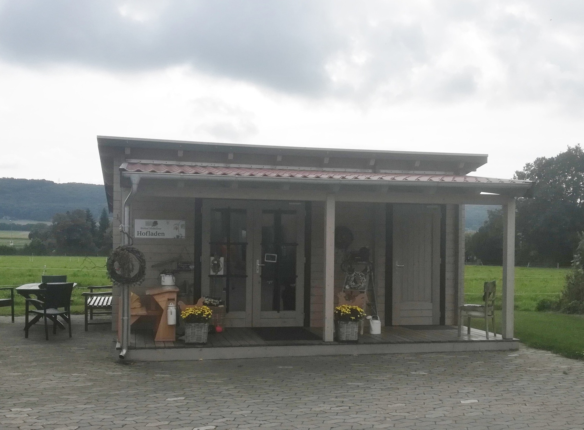

# Tag 1 - Porta Westfalica - Biohof Kinkelbur

## Porta Westfalica (Jana)

Unsere Exkursion startet am Montag den 13. September 2021 gegen 08:00 am [Rundbau des geographischen Instituts](https://geographie.uni-koeln.de/institut/gebaeude/rundbau) der Universität zu Köln. Nach Beladen des gemieteten Vans (Busses) geht die Reise in Richtung Minden los. Dort liegt mit der Porta Westfalica der erste Zwischenstopp unserer zweiwöchigen Exkursion. Auf dem Weg von Köln nach Minden durchqueren wir das nördliche Sauerland sowie den Teutoburger Wald und kommen vormittags am Kaiser-Wilhelm-Denkmal [Kaiser-Wilhelm-Denkmal](https://www.kaiser-wilhelm-denkmal.lwl.org/de/) in Porta Westfalica an. Das Denkmal wurde 1896 nach vier jähriger Bauzeit fertig gestellt und zeigt Wilhelm Friedrich Ludwig von Preußen (1797 – 1988), König von Preußen sowie Deutscher Kaiser. Mit einer Gesamthöhe von knapp 90 m und der erhöhten Lage auf dem Wittekindsberg überwacht das Denkmal den Weserdurchbruch zwischen dem westlich gelegenen Wiehengebirge und dem östlichen Wesergebirge an der Mittelgebirgsschwelle in die Norddeutsche Tiefebene. Das 7 m hohe bronzene Standbild steht auf einem aus Porta-Sandstein errichteten Sockel und wird durch einen steinernen Baldachin überdacht **(Quelle: https://www.kaiser-wilhelm-denkmal.lwl.org/de/denkmal/baugeschichte/)**.

**(Bild einfügen)**

Die geographische Lage des Ehrendenkmals erlaubte kurze Transportwege für den benötigten Baustoff, den Porta-Sandstein. Dieses Gestein entstand durch die Diagenese von sandigem Material, welches im Oberen Dogger (Jura) vor rund 168 Mio. Jahren in Randmeerlage sedimentiert wurde. Während der, vor etwa 100 Mio. Jahren einsetzenden, alpidischen Orogenese kam es zu der Hebung und Aufwölbung eines Höhenzuges. Die Weser teilt dieses Gebirge in Form eines Durchbruchtals wie beschrieben in das östliche Wesergebirge und das westliche Wiehengebirge. Das Gestein der Gebirgszüge ist durch seine braune Färbung und reiche Textur gekennzeichnet. Je nach Fundort kann es unterschiedlich stark gebändert und carbonathaltig sein. Die graue bis deutlich rotbraune Färbung entsteht durch verschieden hohe Eisengehalte, die neben carbonatischen und tonigen Bindemitteln für die verhältnismäßig hohe Verwitterungsresistenz des Gesteins sorgt und es damit zu einem beliebten Baumaterial machen **(Quelle: Ebel & Ehling 2012)**. Heute wird das Gestein in Sand- und Kiesgruben sowie in Steinbrüchen abgebaut. 
In Tieflagen und den Überflutungsgebieten der Weser überwiegen heute Grundwasser beeinflusste Böden wie beispielsweise Gleye sowie verschiedene Auenböden **(Quelle: Elwas)**. Da die Ausgangsgesteine der Bodenbildung häufig kalkhaltig sind und somit Säureeinträge puffern, herrschen neutrale Boden pH-Werte vor. Im Weserbergland sowie im Wiehengebirge dominieren Buchenwälder in unterschiedlichen Vergesellschaftungen wie beispielsweise dem Waldmeister. Auch Mischwälder mit Erlen oder Eichen können angetroffen werden **(Quelle: https://www.wald-und-holz.nrw.de/wald-in-nrw/wuchsgebiete/weserbergland)**.
Die Aussichtsplattform zu Füßen der Statue ermöglicht uns einen ersten Blick in Richtung der Norddeutschen Tiefebene, die wir in den nächsten Tagen weiter bereisen werden. 

## Wasserstraßenkreuz Minden (Jana)

Nach einer Mittagspause in Minden und kleinen Stärkung beim City-Döner führen wir unsere Fahrt fort. Der nächste Stopp ist das Wasserstraßenkreuz Minden etwa 2,5 km außerhalb des Stadtzentrums. Dabei handelt es sich um eine Kreuzung zwischen der von Süden nach Norden fließenden Weser und dem von West nach Ost verlaufenden Mittellandkanal. Der Mittellandkanal wird hier in zwei 370 m langen Trogbrücken über die Weser geleitet. Dabei liegt der mittlere Kanalspiegel etwa 13 m oberhalb dem der Weser. Der alte Kanaltrog hat eine Breite von 24 m und eine Wassertiefe von 3 m. Neben der 1914 fertig gestellten alten Kanalbrücke wurde 1993 eine zweite Kanalbrücke errichtet, deren Abmessungen mit 42 m Breite und 4 m Wassertiefe die Überfahrt für größere Schiffe erlaubt **(Quelle: https://www.wsa-mittellandkanal-elbe-seitenkanal.wsv.de/Webs/WSA/Mittellandkanal-ESK/DE/Wasserstrassen/BauwerkeAnlagen/Kanalbruecken/kanalbruecken_node.html#doc1716756bodyText2)**. Auf den Mittellandkanal können somit Schiffe die Weser kreuzen ohne mit dem Schiffsverkehr auf der Weser zu kollidieren. Eine Verbindung zwischen den beiden Wasserstraßen ist durch mehrere Schleusen und Pumpwerke gegeben. **Abbildung xy** zeigt die alte Kanalbrücke aus südwestlicher Richtung.

**(Bild einfügen)**

Wir gehen ein kleines Stück die Brücke entlang und genießen den Blick hinunter auf die Aue der Weser sowie das Weserbergland und das Wiehengebirge, die sich in südlicher Richtung am Horizont zeigen. Auch der Weserdurchbruch ist zu erkennen **(evtl. Bild einfügen)**. Mit diesem Blick zurück setzen wir unsere Fahrt in den Norden Deutschlands fort und machen uns auf den Weg zu unserem nächsten Zwischenstopp.

## Biohof Kinkelbur (Julia)

Unser nächster Stopp war der [Biohof Kinkelbur](https://www.biohof-kinkelbur.de/). Er liegt im Südwesten von Minden, im Stadtteil Haddenhausen. Der Hof besteht bereits seit 1648 als Familienbetrieb und wird heute vom Ehepaar Friedrich und Ulrike Kinkelbur, ihren beiden Söhnen und einem Team aus ca. 7 MitarbeiterInnen betrieben, darunter Festangestellte, MinijobberInnen und Azubis. Für unseren Besuch trafen wir Friedrich Kinkelbur, der uns bei Tee und Kaffee aus dem eigenen Hofladen den Betrieb vorstellte und uns dann auf dem Gelände herumführte. Zur Begeisterung einiger Exkursions-TeilnehmerInnen begleitete uns dabei ein Katzenjunges, das ebenfalls auf dem Hof lebt und kurzerhand zum zwischenzeitlichen Exkursionsmaskottchen gekürt wurde. 

Auf dem Bauernhof Kinkelbur wird seit 1981 organisch-biologischer Landbau nach den Richtlinien des Bioland-Verbandes betrieben. Vom Hof ausgehend werden sowohl Milch als auch Zucht- und Schlachtvieh, Weizen, Roggen und Kartoffeln sowie Eier und Suppenhühner verwirtschaftet und regional – etwa in lokalen Molkereien und Supermärkten – bzw.  innerhalb der Bio-Schiene vertrieben. Allerdings liegt der klare Schwerpunkt des Hofes auf der Milcherzeugung. 1969 spezialisierte der Hof sich mit dem Ausbau des Stalles zum Boxenlaufstall auf Milchvieh und ergänzte in den darauffolgenden Jahrzehnten die für eine weitere Spezialisierung notwendige Infrastruktur, etwa durch den Bau eines Jungviehstalles und Güllebehälters, den Neubau des Kuhstalles und des Melkhauses, sowie durch die Verlängerung und den Ausbau der Fahrsilos. Im Laufe der Jahre wurden auf dem Hof außerdem eine eigene Maschinenhalle, eine Getreideaufbereitungsanlag und eine Photovoltaikanlage errichtet. 

Durch wiederholte Aufstockung des Viehbestands und die Zupacht eines weiteren Betriebs im Nachbarort 2014 konnte die Milchviehherde des Hofs Kinkelbur von 50 Milchkühen 1996 auf heute 110 Milchkühe anwachsen. Als bemerkenswert hervorzuheben ist dabei die sehr hohe Milchleistung der einzelnen Kühe, die mit jährlich ca. 10.300 kg Milch deutlich über dem aktuellen deutschen Durchschnitt von 8.457 kg liegt (Bundesinformationszentrum Landwirtschaft 2021). Was für einen Biohof zunächst einmal sehr überraschend erscheint, ist in der Züchtung der Kühe begründet. Die für ihre hohe Milchleistung bekannte Rasse Holstein-Friesian wird zwar *bio* gehalten, ist aber auf Leistungsstärke gezüchtet und daher auch in der konventionellen Landwirtschaft sehr populär (Brade & Brade 2010). Gemäß den Richtlinien der biologischen Landwirtschaft werden die Kühe auf dem Hof Kinkelbur mit überwiegend eigens angebautem Bio-Futter ernährt. So erhalten sie Grundmischungen über einen Futtermischwagen und zusätzlich Heu, Mineralfutter und Viehsalz. Hinzu kommen von einem technischen Mitarbeiter individuell zusammengestellte Kraftfuttereigenmischungen, bestehend aus Getreideweizen und Eiweiß-Ergänzer. Wenn der Boden es zulässt, wird die Fütterung durch Kurztagsweide ergänzt. 

Der Biohof verfügt über eine landwirtschaftliche Nutzfläche von insgesamt 165 ha, von der 3,5 ha bewaldet sind, 60 ha als Grünland und 105 ha als Ackerland genutzt werden. An der Bodenbeschaffenheit der landwirtschaftlichen Flächen zeigt sich bereits die moorige Lage des Standorts, die wir durch den Besuch der nahe gelegenen Bastauwiesen am folgenden Tag noch besser kennenlernten. Während das Ackerland teilweise anmoorige Böden aufweist, umfasst das Grünland teildrainiertes Niederungsmoor. Die Unterteilung in Ackerland oder Grünland unterliegt dabei der EU-Direktzahlungen-Durchführungsverordnung (Art. 4 VO (EU) 2013/1307 Abs. 1 h) und ist an strenge Regelungen gebunden. So muss als Grünland genutztes Land mindestens alle fünf Jahre durchgepflügt werden, um nicht als Dauergrünland festgeschrieben zu werden. Da Dauergrünland einem generellen Umwandlungs- und Pflugverbot unterliegt, bietet es für die weitere Nutzung weniger Möglichkeiten der Bearbeitung, sodass eine solche Umstellung an einen Wertverlust der Fläche gekoppelt ist. Herr Kinkelbur erzählte uns dahingehend die Anekdote, dass das Zeitfenster auf einer seiner angepachteten Flächen durch eine Fehlrechnung überschritten wurde und eine als Grünland genutzte Fläche nun unbeabsichtigt als Dauergrünland an den Verpächter zurückgegeben wird, sodass mit einer Schadensersatzforderung gerechnet werden kann. Während sich die wirtschaftlich negativen Folgen dieser Regelung in dieser Anekdote bereits offenbaren, wird auf ihre ökologischen Folgen im Beitrag zu den Mooren und Baustauwiesen noch einmal eingegangen. 

Wie von den Richtlinien des Bioland-Verbands vorgeschrieben, wird auf den genutzten Flächen grundsätzlich auf chemischen Pflanzenschutz verzichtet. Manche regional verfügbaren Pflanzen, die den Boden sehr fruchtbar hinterlassen würden, wie etwa Raps, können also nicht angebaut werden, weil sie in der Regel nur durch diesen bestehen können. Für eine Minimierung von Unkraut sowie die Erhaltung und Förderung der Bodenfruchtbarkeit werden die Ackerflächen stattdessen mit einer spezifischen Fruchtfolge bestellt, die je nach Bodenbeschaffenheit unterschiedlich ausfällt. Auf Lehmstandorten werden in zwei aufeinanderfolgenden Jahren Kleegras, dann Mais, Winterweizen, Kartoffeln und wiederum Winterweizen angebaut. Auf den anmoorigen Standorten werden Kleegras, dann Winterweizen und danach Winterroggen angebaut. Im Sommer wird auf allen Standorten eine Blanksaat von Rotklee, Schwingel, Lieschgras und deutsches Weidelgras ausgebracht. Die Saat und Pflege erfolgt maschinell, durch Anbausämaschine, Hackstriegel, Rollhacke, diverse Hackmaschinen, Kartoffelhäufelgerät und Nachsaatstriegel für Grünland. Die Ernte erfolgt ebenfalls maschinell, durch Mähwerke, Wender und Schwader, Kartoffelroder vollzogen, der Transport durch diverse Kipper und Anhänger. 

Insgesamt wird auf dem Hof Kinkelbur versucht, einen möglichst lebendigen Organismus bzw. biologischen Kreislauf aufrechtzuerhalten. Eine besonders wichtige Rolle spielt dabei das Kleegras. Es liefert Futter für die Kühe, deren Gülle dem Boden zur Steigerung der Fruchtbarkeit zurückgegeben wird. Daneben sorgt es für eine Humusanreicherung des Bodens, was den nachfolgenden Kulturen ebenfalls als wichtige Nähstoffquelle dient. Als dichte Matte unterdrückt es außerdem eine große Menge an Unkraut, dessen aufkommende Reste dann mit Hacke und Striegel einfach entfernt werden können. Das nach der Getreideernte anfallende Stroh, wird den Kühen dann wiederum als Unterlage in die Ställe zurückgegeben. 

Die jüngsten Veränderungen auf dem Hof Kinkelbur gehen auf die Pandemie 2020 zurück. Während die landwirtschaftliche Tätigkeit selbst davon weitestgehend unbeeinflusst blieb, erschienen im Zuge des Lockdowns immer mehr BesucherInnen, insbesondere junge Familien, auf dem Hof, die ihn als Tagesausflugsziel nutzten. Wohl in der Intention, einen Streichelzoo-Ersatz zu finden, kamen manche dabei auch den Tieren zu nahe. Durch das Aufstellen von Schildern, die die BesucherInnen zur Vorsicht und Rücksichtnahme sensibilisieren sollten, reagierte Familie Kinkelbur auf diese Entwicklungen. Die Veränderungen boten aber auch die Chance für neue Projekte, wie etwa für den Aufbau zweier neuer Hühnermobile mit je 345 Hennen, die eine Reaktion auf die steigende Nachfrage nach Bio-Eiern darstellten. Auch der von uns vorgefundene Selbstbedienungs-Hofladen wurde zur Direktvermarktung einiger Waren auf dem Hof in dieser Zeit errichtet.

## Oberlübber Bergsee (Jana)

Am nördlichen Rande des Wiehengebirges machen wir Halt und gehen zu Fuß zu unserem nächsten Standort. Nach einem etwa 10-minütigen Aufstieg erreichen wir den Oberlübber Bergsee. Dabei handelt es sich um einen ehemaligen Steinbruch in dem das vorrangig kalkhaltige Sandgestein des Wiehengebirges abgebaut wurde. Nach Beendigung des Abbaus **(wann?)** entstand ein See, der über steile Uferflanken verfügt. Aufgrund der Unfallgefahr ist der See heute durch einen Zaun der Öffentlichkeit unzugänglich gemacht.
Wir gehen den Weg ein Stück weiter bergauf und bekommen an einem erodierten Hang direkt neben dem Weg einen Eindruck über das hier vorliegende Gestein. Besonders auffällig ist die starke Verstellung der zu erkennenden Schichten. Man beschreibt die „Schiefe“ der Gesteinsschichten mit Hilfe des Steichens und Fallens. Dabei gibt die Streichrichtung die Orientierung, die Fallrichtung das zur Streichrichtung senkrecht stehende Einfallen der Gesteinsschicht an. **(Wie waren die Richtungen vor Ort?).** Ein Test mit **xy %-iger** Salzsäure zeigt uns, dass das Gestein nicht kalkhaltig ist, obwohl es sich wie wir zuvor gelernt hatten, um ursprünglich kalkhaltiges Gestein handelt. Gründe für die Entkalkung des Materials und die zugrunde liegenden Prozesse werden wir am nächsten Standort genauer diskutieren.
Über dem stark verstellten Untergrundgestein, ist ein geringmächtiger humoser Oberboden zu erkennen. Da es sich bei dem Ausgangsgestein um ein **(entkalktes)** Carbonatgestein handelt, wir der Boden nach der deutschen Bodenklassifikation als Rendzina bezeichnet. 

**(Bild einfügen)**

Wir verlassen das Wiehengebirge in nördliche Richtung und begeben uns auf den Weg zu unserem letzten Standort für diesen Tag.

## Kolluvisol (Jana)

Im nördlichen Vorland des Wiehengebirges machen wir Halt am Rande eines Rapsfeldes. Hier wollen wir uns mit Hilfe eines Pürckhauer Bohrstockes den Ackerboden anschauen. Wir achten dabei insbesondere darauf, eine Schädigung der jungen Rapspflanzen zu vermeiden. An einigen Pflanzen sind jedoch bereits kleine Löcher in den Blättern zu erkennen. Dabei handelt es sich um den typischen Lochfraß des Rapserdflohs (Psylliodes chrysocephala). 

**(Bild einfügen)** 

Dieser Schädling verursacht im Herbst an jungen Rapspflanzen die in **Abbildung xy** ersichtliche Durchlöcherung der Keimblätter. Der Befall kann zu Ertragsminderungen führen, zumeist verursacht der Schädling jedoch nur Schädigungen der Keimlinge. Außerdem kann des zu einer Verbreitung des Schädlings in angrenzende Rapsbestände kommen. Im ökologischen Landbau ist eine direkte Bekämpfung des Rapserdflohs nicht möglich. Die Fruchtfolge sollte entsprechend angepasst werden, da andere Ackerpflanzen nicht anfällig für den Schädling sind. Die Eiablage kann durch eine Mulchsaat gehemmt werden. Außerdem können räuberische Arten den Bestand vor einem übermäßigen Befall schützen. **(Quelle: https://www.oekolandbau.de/landwirtschaft/pflanze/grundlagen-pflanzenbau/pflanzenschutz/schaderreger/schadorganismen-im-ackerbau/rapserdfloh-psylliodes-chrysocephala/)** Neben den beschriebenen Schädigungen der Pflanze, erkennen wir kleine grüne Körner in regelmäßiger Verteilung auf dem Acker. Wir vermuten, dass es sich dabei um Schneckenkorn handelt, das im Randbereich des Feldes ausgebracht wurde, um ein Einwandern von Schnecken zu verhindern. 

Die mit Hilfe des Pürckhauers entnommene Bodenprobe zeigt einen etwa 40 cm mächtigen humosen Oberboden auf einem entkalkten und lockeren Ausgangsgestein. Dabei handelt es sich um Löss, der innerhalb von Kaltzeiten **(wann?)** äolisch abgelagert und im Anschluss durch unterschiedliche pedogenetische Prozesse verändert wurde. An diesem Standort ist der Löss entkalkt sowie verwittert und muss als Lösslehm bezeichnet werden. Uns fällt auf, dass der dunkel gefärbte Oberboden im Gegensatz zum Lösslehm kalkhaltig ist. Da Entkalkungsprozesse üblicherweise mit dem Sickerwasser von oben nach unten ablaufen, ist das hier vorgefundene Phänomen ungewöhnlich. Die Herkunft des Carbonates kann durch zwei Prozesse erklärt werden. Zum einen ist eine anthropogene Kalkung als Meliorationsmaßnahme des Bodens möglich. Landwirtschaftlich genutzte Flächen werden häufig gekalkt um den pH-Wert des Bodens zu erhöhen und einer Versauerung des Bodens entgegenzuwirken. Calciumcarbonat (CaCO3) wird dazu auf den Oberboden aufgetragen und neutralisiert den Einfluss von Säuren, die beispielsweise bei der Atmung von Bodenlebewesen, der Nährstoffaufnahme von Pflanzenwurzeln oder durch saure Einträge aus der Atmosphäre entstehen **(Quelle: https://www.bmel.de/DE/themen/landwirtschaft/pflanzenbau/bodenschutz/bodenfruchtbarkeit-kalkung-grundlagen.html)**. Eine zweite mögliche Ursache für den carbonathaltigen Oberboden ist die Verlagerung von Hydrogencarbonat (HCO3–) mit Hangzugwasser aus dem carbonathaltigen Gestein des Wiehengebirges. Säuren – wie beispielsweise Kohlensäure (H2CO3), die durch die Reaktion von Kohlenstoffdioxid (CO2) mit Wasser entsteht – lösen das CaCO3 aus kalkhaltigem Gestein unter Freisetzung von Calcium (Ca2+) -Ionen und HCO3–. Das gelöste HCO3– wird mit dem Sicker- und Oberflächenwasser verlagert und kann an anderen Orten wieder ausgefällt werden **(Quelle)**. Es ist sehr wahrscheinlich, dass dieser Prozess zu einer sekundären Aufkalkung des Bodens führte. Ob der Boden zusätzlich anthropogen gekalkt wurde ist nicht mit Sicherheit zu sagen. Die mächtige Lage an humosem Bodenmaterial entsteht durch die Verlagerung von Oberbodenmaterial mit dem Relief durch erosive Prozesse. Dieses so angereicherte Material wird als Kolluvium, der entstandene Boden als Kolluvisol bezeichnet. Der diagnostische Horizont des Kolluvisols ist der M-Horizont. **(Quelle)**

Wir fahren noch ein Stück weiter in nördliche Richtung und lassen den Tag bei einem gemeinsamen Bier am Rande der Bastauwiesen, die wir uns am nächsten Tag genauer anschauen werden, ausklingen und freuen und auf ein leckeres Abendessen, ein nettes abendliches Beisammensein und eine erholsame Nacht. Gerne wird von einigen ExkursionsteilnehmerInnen das Wellnessangebot der  [Wiehen-Therme](https://www.wiehen-therme.com/) angenommen.

