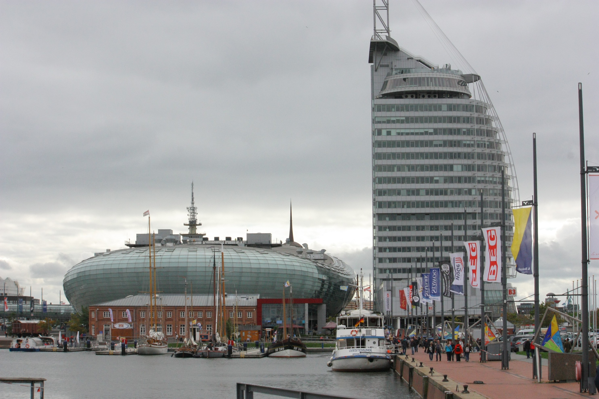
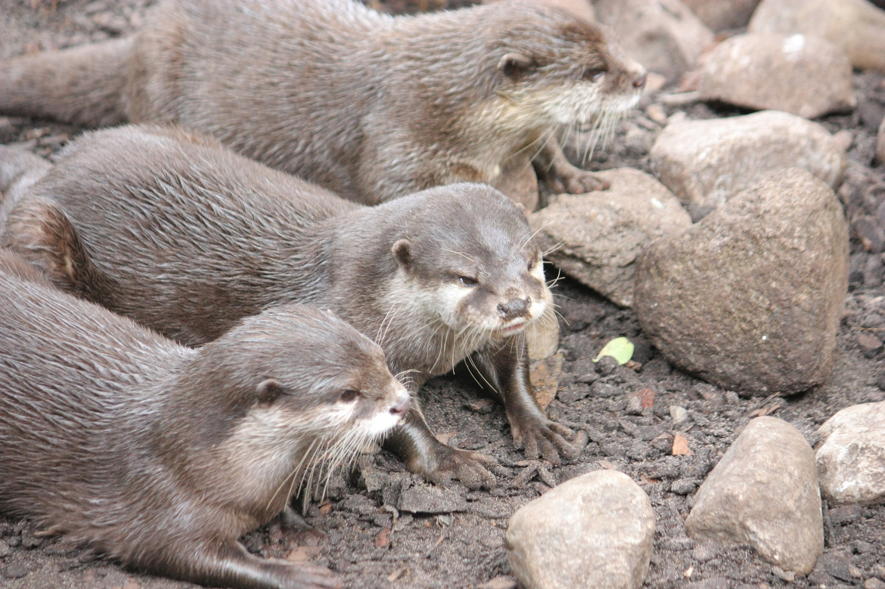
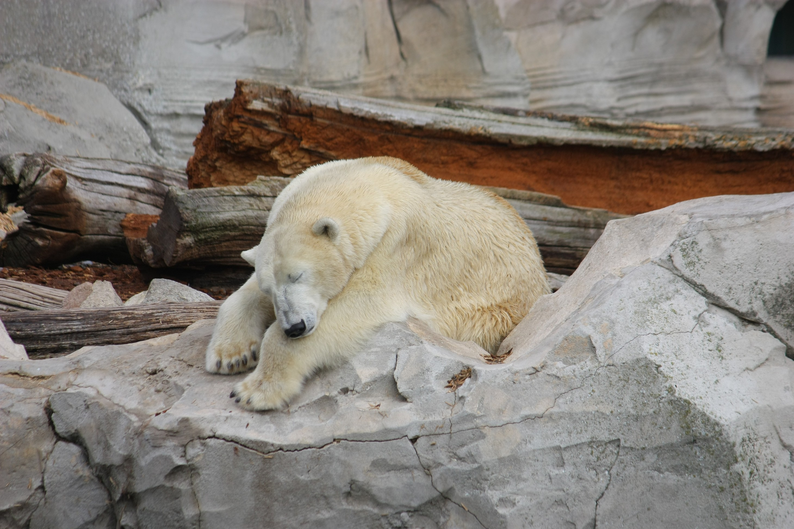
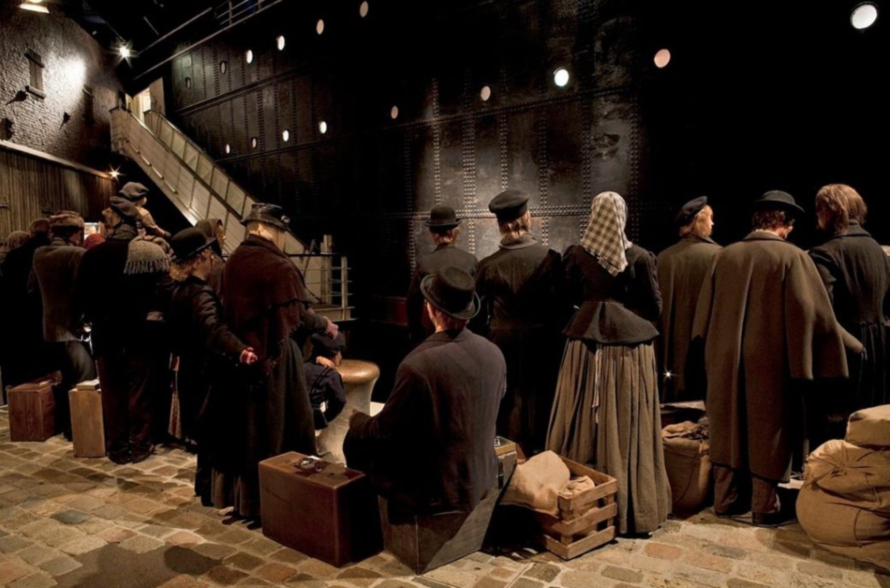
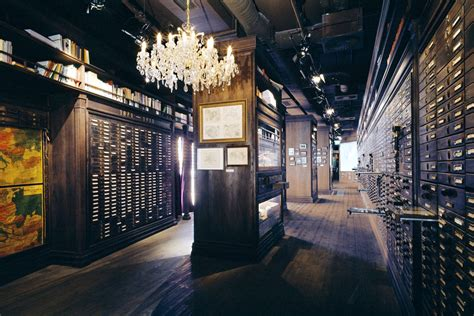
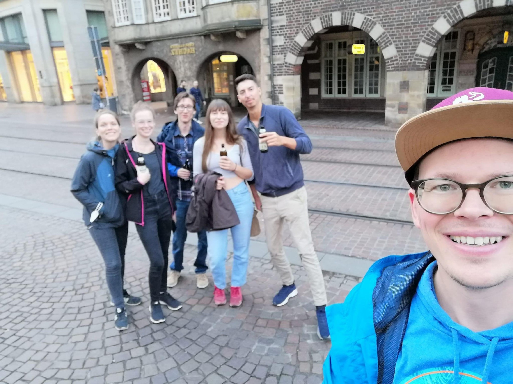
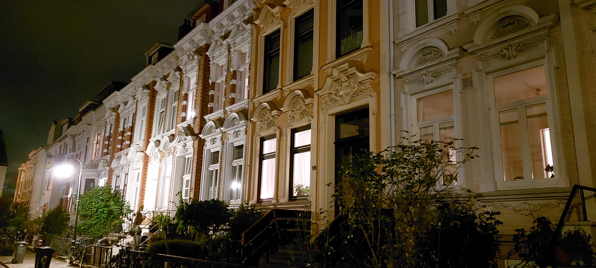
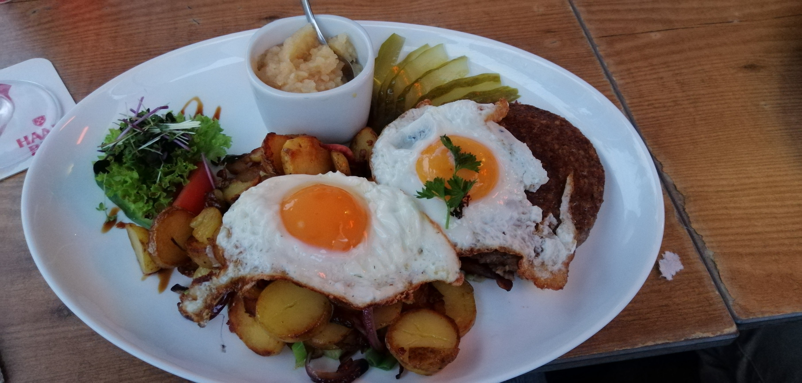
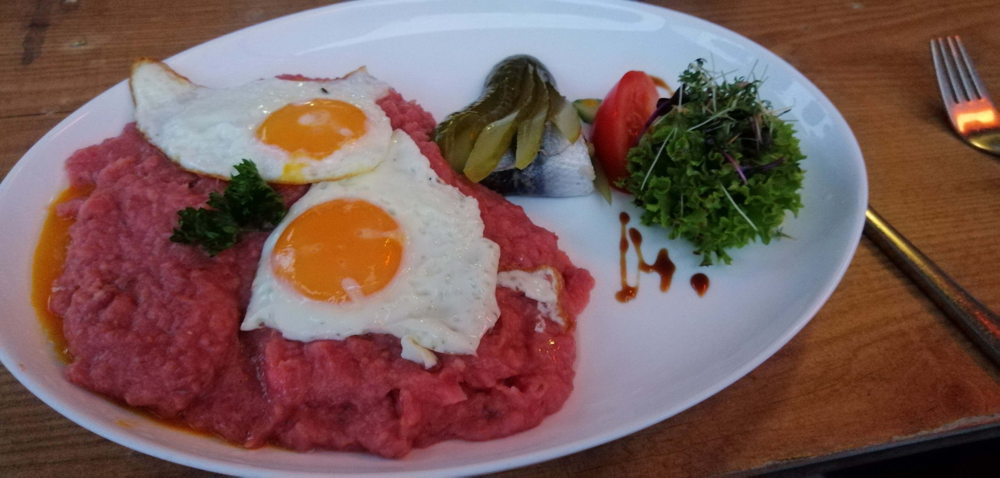

# Donnerstag, 16.09.2021

Abfahrt: Hostel in Bremen

Standorte: Bremerhaven, Bremer Innenstadt

Ankunft: Hostel in Bremen


<div style="text-align: justify">


</div>
## Das Klimahaus (Christian)
<div style="text-align: justify">

Nachdem die erste Nacht in der Unterkunft in Bremen trotz diverser Widrigkeiten von allen TeilnehmerInnen überstanden wurde, kamen wir das erste mal in den Genuss der Vorzüge einer Norddeutschen Großstadt. 

Versuche einen die Exkursion begleitenden Computerkurs zu starten scheiterten, da die ewige Suche nach einer Wlanverbindung welche sich wie ein roter Faden durch die gesamte Reise zog, auch an diesem Morgen in Bremen keine Früchte trug.
Deshalb brachen wir kurz nach einem herzhaften Tankstellenfrühstück umgehend nach Bremerhaven auf.
Das Ziel war hier nicht etwa die Innenstadt, sondern der alte Hafen von Bremerhaven, da sich hier zwei Hauptattraktionen des Bundeslandes befinden:
Das Klimahaus und das Deutsche Auswandererhaus Bremerhaven.

Da der stramme Zeitrahmen nur den Besuch einer dieser beiden Institutionen erlaubte, und es Diskrepanzen bei der Prioritätensetzung innerhalb der Gruppe gab, wurde kurzerhand beschlossen die Gruppe aufzuteilen.

Beim Klimahaus handelt es sich um eine Art Lehr- und Ausstellungsgebäude, in dem die Vielfalt und die Zusammenhänge der Klimata unseres Planeten auf anschauliche und spielerische Art dem Besucher nahegebracht werden.

```{r, echo=FALSE, out.width="100%", fig.cap="Das Klimahaus in Bremerhaven links im Bild (außenansicht)"}

```

Unglücklicherweise war das Klimahaus nur Besuchern offen welche eine vorherige Reservierung gebucht hatten, weshalb diese Gruppe auf den naheliegenden Zoo ausweichen musste. Da dieser bis auf ein paar niedliche Fischotter relativ unspektakulär war, soll es an dieser Stelle auch mit der Erzählung der Erlebnisse der zweiten Gruppe weitergehen.

```{r, echo=FALSE, out.width="100%", fig.cap="Fischotter im Zoo von Bremerhaven."}

```


```{r, echo=FALSE, out.width="100%", fig.cap="Eisbär im Zoo von Bremerhaven."}

```

</div>

## Das Deutsche Auswandererhaus Bremerhaven (Christian)

<div style="text-align: justify">

Der zweiten Gruppe gelang trotz langer Wartezeit tatsächlich der Eintritt ins Deutsche Auswandererhaus Bremerhaven, ein Museum welches sich als hochinteressant entpuppte.


```{r, echo=FALSE, out.width="100%", fig.cap="Deutsches Auswandererhause Bremerhaven (Quelle: Bremen.de 2021)."}
knitr::include_graphics("images/Christian vorsortiert/Bremerhaven/7616c34034aa318a533840ee8ca2c314.jpg")
```

Bremerhaven war im 19. und bis in die Mitte des 20. Jahrhunderts einer der bedeutendsten Häfen für die Ausschiffung von Emigranten aus Mittel- und Osteuropa in die neue Welt.
Meist von sozialer Not getrieben, bestiegen hier von 1830 an 7,2 Milionen Menschen die Passagierschiffe der eigens darauf spezialisierten Redereien, welche sie über den Atlantik tragen sollten.

Die Ausstellung ist so aufgebaut, dass sie die Besucher durch Nachbauten der  einzelnen Stadien führt die auch ein Auswanderer der damaligen Zeit durchgehen musste, angefangen in den Massenunterkunftshallen am Kai, über den Hafen, durch die Unterkünfte am Zwischendeck bis nach Ellis Island in New York.

```{r, echo=FALSE, out.width="100%", fig.cap="Nachbau des Eingangs eines Passagierschiffes im Bremer Auswandererhaus (Quelle: Bremen.de 2021)."}

```


Dabei werden den Besuchern auch die persönlichen Schicksäle der Familien oder Einzelpersonen durch Logbucheinträge oder Tagebücher nahegebracht. Insbesondere dadurch, dass jeder Besucher den "Fahrtschein" einer realen Person erhält, dessen jeweiliges Schicksal er in der Ausstellung erfährt, wird die Ausstellung besonders immersiv. Parallel zu den voranschreitenden Stationen der Auswanderung verändert sich auch die Epoche die man durchschreitet, vom Ende des 17.Jhdts bis in die 1950er Jahre. Dadurch tut sich eine Vielfalt interessanter Einzelschicksale auf von  politischen Verfolgten der gescheiterten Revolution von 1848, über Armutsflüchtlinge aus dem Russischem Kaiserreich, bis zu den Heimatvertriebenen der Nachkriegszeit.

```{r, echo=FALSE, out.width="100%", fig.cap="Archiv von Logbucheinträgen und Tagebuchseiten ehemaliger Passagiere (Quelle: Andreas Heller 2021)."}

```

Nach dem erfolgreichen Landgang in Ellis Island befindet sich am Schluss des Rundgangs zusätzlich auch ein Austellungs- und Diskussionsforum in welchem ethische Fragen rund um Staatsbürgerschaft und Migration in der heutigen Zeit diskutiert werden.
Auch eine Datenbank in der jeder Besucher Verwandte oder Vorfahren recherchieren kann welche in Bremerhaven ausschifften ist ganz am Ende der Ausstellung zu finden.

## Bremer Altstadt (Christian)
<div style="text-align: justify">

Nach dem Mittagessen an der Fischrestaurantmeile des alten Hafens ging es dann zurück in die Landeshauptstadt, wo wir eine ausführliche Stadtführung der ortsansässigen Anja bekamen.
Dabei ging es zuerst durch die Bremer Altstadt, die ganz klar von einem Grüngürtel begrenzt ist der noch die Form  der alten Stadtmauern erahnen lässt.
Im Zentrum befinden sich auch die beiden Dome und die Bremer Stadtmusikanten als Attraktionen der Stadt.

```{r, echo=FALSE, out.width="100%", fig.cap="Die Gruppe in der Innenstadt."}

```


Die eigentliche Führung ging aber durch Ostertor und Steintor. Diese südwestlich an die Altstadt anschließenden Viertel, im Volksmund einfach nur "Viertel" genannt, sind laut Anja der viel interessantere Teil der Stadt, in dem sich auch ein Großteil des Nachtlebens abspielt.

Durch die gesamte Stadt zieht sich dabei die typische Bremer Bauform der dreigeteilten Häuser.
Meist halb erhöht, sind diese oft sehr schmal gebaut, da die Grundsteuer in der Hansestadt früher an der breite der Hausfront berechnet wurde. Auch spiegelt sich hier der historisch gewachsene demokratische und egalitäre Charakter der Stadt wieder. Da es der Bremer Bürgerschaft von jeher wichtig war, dass ein jeder Bürger der Stadt über ein eigenes Haus verfügen solle, sucht man vergebens Mietskasernen und Mehrfamilienhäusern. Stattdessen besteht beinahe die gesamte Stadt aus dreigeteilten, dreistöckigen Häusern die in ihrer Größe erheblich variieren. Immer haben diese auch einen eigenen Garten im Hinterhof, sodass es anders als in Lübeck keine verwinkelten Innenhofgassen gibt.


```{r, echo=FALSE, out.width="100%", fig.cap="Typische Bremer dreigeteilte Häuser."}
knitr::include_graphics("images/Jana/20210916_175454.jpg")
```

```{r, echo=FALSE, out.width="100%", fig.cap="Bremer Häuser in einer wohlhabenderen Straße."}

```

Von Anja geführt, ging es dann in eines der besten Restaurants der Stadt. Hier kamen wir in den Genuß von Speis und Trank lokaler Couleur, nachhaltig beliefert von lokalen Bauernhöfen. Zu den Spezialitäten gehörten nordische häppchen, Bratkartoffeln mit Knips (eine Grützwurst), sowie Labskaus, welcher insbesondere die süddeutsche Fraktion der Gruppe begeisterte. 


```{r, echo=FALSE, out.width="100%", fig.cap="Bratkartoffeln mit Knips."}

```

```{r, echo=FALSE, out.width="100%", fig.cap="Bremer Labskaus."}

```


Hierbei handelt es sich um einen auf den ersten Blick wenig appetitlich anmutenden Brei aus Rindfleisch, Kartoffeln, Gewürzgurken und roter Beete, wozu noch Spiegelei und Rollmops als Beilage gereicht wird. Der Anblick täuscht jedoch darüber hinweg, dass es sich hierbei um eine Delikatesse handelt, deren wagemutige Kombination von Zutaten noch jede Kreation der experimentierfreudigen Hipsterköche am prenzlauer Berg in den Schatten stellt. Der Labskaus zergeht auf der Zunge wie Butter, die einzelnen Elemente sind dabei untrennbar vermengt und schaffen einen zugleich deftigen und leicht sauren, doch auch fleischlich saftigen Geschmack. Das Spiegelei setzt willkommene Akzente und der Rollmops sorgt für eine salzige Abrundung.

Wem das nun erscheint als habe jemand einfach den gesamten Inhalt seines Vorratsschranks zu einer Mahlzeit verarbeitet, der liegt nicht ganz falsch. Entstanden ist dieses Gericht nämlich in Schiffskombüsen, als Methode um möglichst alle vorhandenen Zutaten auch bei zunehmender Verderbung auf langen Seereisen zu verarbeiten. Auch die weiche Konsistenz ist dabei sicherlich auf die Seefahrer zurückzuführen, die oftmals durch ihre von Skorbut geschädigte Kauleiste feste Nahrung nur schwer zu sich nehmen konnten.

Auch die Getränkeauswahl stand mit Haakebeck, Weißbier und Korn der Speisekarte in nichts nach, was der allgemeinen Erheiterung der Gruppe einen Erheblichen Aufschwung gab. Und so kehrten wir über Umwege und mit einigen Zwischenstopps bester Laune spätabends zum Hotel zurück, dank Anja um unzählige lustige Geschichten und Anekdoten weiser.


**Quellen**

Andreas Heller, 2021. Dauerausstellung im Deutschen Auswandererhaus. Migrationsgeschichte erzählerisch inszeniert. https://andreas-heller.de/dauerausstellung-im-deutschen-auswandererhaus/, zuletzt geprüft am 10.12.2021.

Bremen.de, 2021. Deutsches Auswandererhaus Bremerhaven. https://www.bremen.de/kultur/museen-und-wissenswelten/deutsches-auswandererhaus-bremerhaven, zuletzt geprüft am 10.12.2021.

</div>


