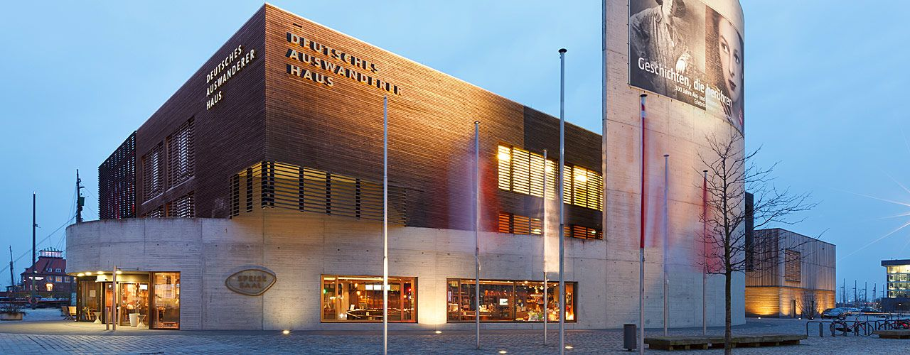
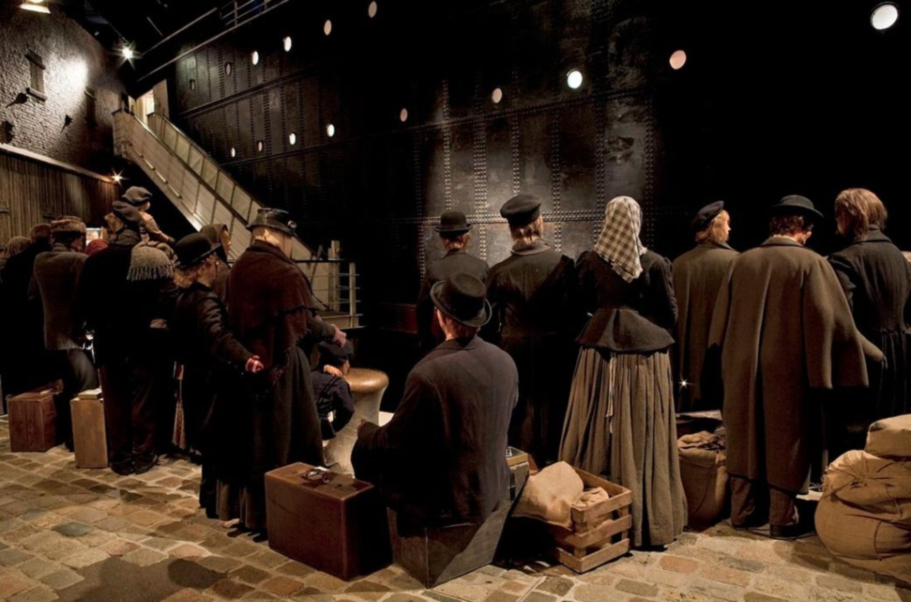
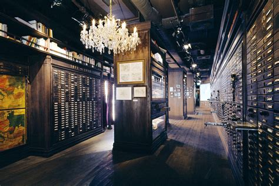
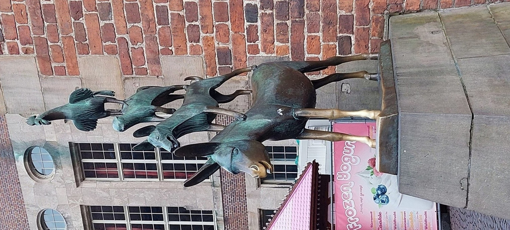

# Tag 4 - Bremen und Bremerhaven

Nachdem die erste Nacht in der Unterkunft in Bremen trotz diverser Widrigkeiten von allen Teilnehmern überstanden wurde, kam die Exkursionsgruppe das erste mal in den Genuss der Vorzüge einer Norddeutschen Großstadt. 

Versuche einen Computerkurs zu starten scheiterten, da die ewige Suche nach einer Wlanverbindung welche wie ein roter Faden durch die gesamte Reise zog, auch an diesem Morgen in Bremen keine Früchte trug.
Deshalb brachen wir kurz nach einem herzhaften Tankstellenfrühstück umgehend nach Bremerhaven auf.
Das Ziel war hier nicht etwa die Innenstadt, sonder die Bremerhavener Hafenanlage, da sich hier zwei Hauptattraktionen des Bundeslandes befinden:
Das Klimahaus und das Deutsche Auswandererhaus Bremerhaven.
Da der stramme Zeitrahmen nur den Besuch einer dieser beiden Institutionen erlaubte, und es Diskrepanzen bei der Prioritätensetzung innerhalb der Gruppe gab, wurde kurzerhand beschlossen die Gruppe aufzuteilen.

## Das Klimahaus

Beim Klimahaus handelt es sich um eine Art Lehr-und Ausstellungsgebäude, in denen die Unterschiede und Zusammenhänge der Klimata unseres Planeten auf anschauliche und spielerische Art dem Besucher nahegebracht werden.

Unglücklicherweise war das Klimahaus nur Besuchern offen welche eine vorherige Reservierung gebucht hatten, weshalb diese Gruppe auf den naheliegenden Zoo ausweichen musste. Da dieser bis auf ein paar niedliche Otter relativ unspektakulär war soll es an dieser Stelle auch mit der Erzählung der Erlebnisse dieser Teilgruppe gewesen sein.

## Das Deutsche Auswandererhaus Bremerhaven

Der zweiten Gruppe gelang trotz langer Wartezeit tatsächlich der Eintritt ins Deutsche Auswandererhaus Bremerhaven, ein Museum welches sich als hochinteressant entpuppte.

Bremerhaven war im 19. und bis in die mitte des 20. Jahrhunderts einer der bedeutendsden Häfen für die Ausschiffung von Emigranten aus Mittel- und Osteuropa in die neue Welt.
Meist von sozialer Not getrieben bestiegen hier ab 1830 7,2 Milionen Menschen Passagierschiffe die sie über den Atlantik tragen sollten.
Die Ausstellung ist so aufgebaut, dass sie den Besucher durch Nachbauten der  einzelnen Stadien führt die auch ein Auswanderer der damaligen Zeit durchgehen musste, angefangen in den Massenunterkunftshallen, über den Hafen, durch die Unterkünfte am zwischendeck bis nach Ellis Island in New York.

{width=100}

Dabei werden dem Besucher auch die persönlichen Schicksäle der Familien oder Einzelpersonen durch Logbucheinträge oder Tagebücher nahegebracht. Insbesondere dadurch, dass jeder Besucher den "Fahrtschein" einer realen Person erhält, dessen jeweiliges Schicksal er in der Ausstellung erfährt, wird die Ausstellung besonders immersiv.

 

Am Schluss der Ausstellung befindet sich zusätzlich auch ein Austellungs- und Diskussionsforum in welchem ethische Fragen rund um Staatsbürgerschaft und Migration in der heutigen Zeit diskutiert wird.
Auch eine Datenbank in welcher jeder Besucher Verwandte oder Vorfahren recherchieren kann welche in Bremerhaven ausschifften ist ganz am Ende der Ausstellung zu finden

## Bremer Altstadt

Nach dem Mittagessen an der Fischrestaurantmeile in Bremerhaven ging es dann zurück in die Landeshauptstadt, wo die Gruppe eine ausführliche Stadtführung der ortsansässigen Anja bekam.
Dabei ging es durch die Bremer Altstadt, die ganz klar von einem Grüngürtel begrenzt ist der noch die Form  der alten Stadtmauern erahnen lässt.
Im Zentrum befinden sich auch die beiden Dome und die Bremer Stadtmusikanten als Attraktionen der Stadt.

Südwestlich an die Altstadt schließen sich die im Volksmund einfach nur "Viertel" gennanten Stadtteile Ostertor und Steintor an, in welchen ein großteil des Bremer Nachtlebens stattfindet.
Durch die gesamte Stadt zieht sich dabei die typische Bremer Bauform der dreigeteilten Häuser.
Meist auch halb erhöht, sind diese oft sehr schmal gebaut, da die Grundsteuer in der Hansestadt früher an der weite der Hausfront berechnet wurde. Auch spiegelt sich hier der historisch gewachsene demokratische und egalitäre charakter der Stadt wieder. Da es der Bremer Bürgerschaft von jeher wichtig war das jeder Bürger der Stadt über ein eigenes Haus verfügen solle, sucht man vergebens Mietskasernen und Mehrfamilienhäusern. Stattdessen besteht die gesamte Stadt aus dreigeteilten, dreistöckigen Häusern die in ihrer Größe erheblich variieren, immer auch mit eigenem Garten im Hinterhof. 

Von Anja geführt, ging es dann in eines der besten Restaurants der Stadt. Hier kam die Gruppe in den Genuß von Speis und Trank lokaler Couleur, nachhaltig beliefert von lokalen Bauernhöfen. Zu den Spezialitäten gehörten nordische häppchen, Bratkartoffeln mit Knips (eine Grützwurst), sowie Labskaus, welcher insbesondere die südländische Fraktion der Gruppe begeisterte. 

Hierbei handelt es sich um einen auf den ersten Blick wenig appetitlich anmutenden Brei aus rohem Rindfleisch, Kartoffeln, Gewürzgurken und roter Beete, wozu noch Spiegelei und Rollmops als Beilage gereicht wird. Der Anblick täuscht jedoch darüber hinweg das es sich hierbei um eine delikatesse handelt, deren wagemutige Kombination von Zutaten noch jede Kreation der experimentierfreudigen Hipsterköche am prenzlauer Berg in den Schatten stellt. Der Labskaus zergeht auf der Zunge wie Butter, die einzelnen Elemente sind dabei untrennbar vermengt und schaffen einen zugleich deftigen und leicht sauren, fleischlich saftigen Geschmack. Die Eiweißnote des Spiegleis setzt willkommene Akzente und der Rollmops sorgt für eine salzige Abrundung. Wem das nun erscheint als habe jemand einfach den gesamten Inhalt seines Vorratsschranks zu einer Mahlzeit verarbeitet der liegt nicht ganz falsch. Entstanden ist dieses Gericht nämlich in Schiffskombüsen, als Methode um alle vorhandenen Zutaten auch bei zunehmender Verderbung auf langen Seereisen zu verarbeiten. Auch die weiche Konsistenz ist dabei sicherlich auf die Seefahrer zurückzuführen, die oftmals durch ihre von Skorbut geschädigte Kauleiste feste Nahrung nur schwer zu sich nehmen konnten.
Auch die Getränkeauswahl stand mit Haakebeck, Weißbier und Korn der Speisekarte in nichts nach, und so kehrte die Gruppe über Umwege und mit einigen Zwischenstopps bester Laune spätabends zum Hotel zurück, dank Anja um unzählige Geschichten und Anektoden weiser.

