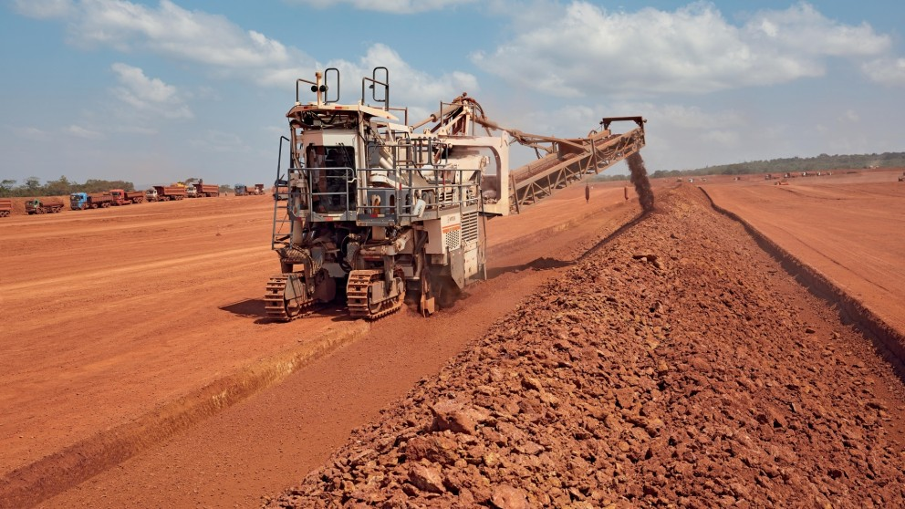
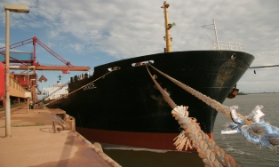
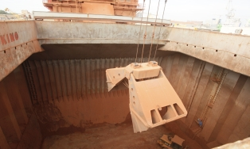
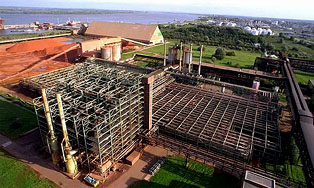
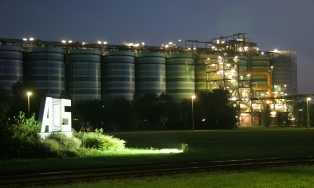
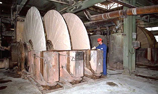
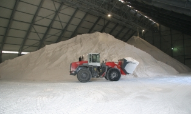

# Freitag, 17.09.2021

Abfahrt: Hostel in Bremen

Standorte: Aluminiumoxid-werke Stade, Herzapfelhof im Alten Land

Ankunft: Jugendherberge Stade

## Besuch der Aluminiumoxid-werke Stade (Christian)

<div style="text-align: justify">
Nachdem wir uns schweren Herzens von unserem Hotel in Bremen verabschiedet hatten, ging es nun wieder hinaus aufs Land, richtung Nordosten an die Niedersächsiche Elbküste.

Hier besichtigte unsere Exkursionsgruppe die Aluminiumoxidwerke in Stade, und tauchte so in die Welt der Schwerindustrie ein.
Die gleichnamige Firma wurde 1973 gegründet und ist mittlerweile der einzig verbliebene Großhersteller von Aluminiumhydroxid und Aluminiumoxid in Deutschland. Bei der Führung übers Werksgelände bekam die Gruppe dabei einen Einblick in den gesamten Produktionsablauf, vom Ausgangsmaterial Bauxit bis zum fertigen Aluminiumoxid.

Der Fertigungsprozess beginnt an der Elbeküste im werkseigenen Hafen. Das Bauxit das hier ankommt stammt von Tagebauen in den Tropen, etwa aus Australien oder Afrika, da Bauxit (bzw. die Lateritböden welche es enthalten) nur unter tropischen Verwitterungsbedingungen entsteht. Bei Bauxit handelt es sich um ein Gestein welches einen Besonders hohen Aluminiumanteil aufweist. Zwar ist Aluminium mit einem Gewichttsanteil von 7,5% an der Erdkruste eines der häufigsten Elemente auf Erden, jedoch ist dessen Anteil in Silikatgesteinen relativ gering. Währenddessen liegt er bei Bauxit  bei bis zu 50%, wodurch die Aluminiumgewinnung erst rentabel wird.

```{r, echo=FALSE, out.width="100%", fig.cap="Bauxitabbau in Guinea, Güterschiff im Werkseigenen Hafen und Löschung der Ladung (Quelle: Aluminium Oxid Stade GmbH 2021)"}

```


 


Die Lage an der Elbe ist dabei von zentraler Bedeutung für den Erfolg des Werkes, da der Transport von Schwerlasten wie Bauxit auf Hochseeschiffen um ein vielfaches günstiger ist als über Land. Schätzungsweise wäre selbst der Transport des Bauxits von Rotterdam nach Stade per Lastwagen ebenso teuer wie der gesamte vorangegangene Transport per Schiff aus Australien. 

Das Bauxit wird nach dem Transport über Förderbänder dann  gemahlen und mit Natronlaufe versetzt. Mit diesem Schritt beginnt das Bayerverfahren, mit welchem seit seiner Entwicklung im Jahr 1888 Aluminium aus Bauxit gewonnen werden kann. In der Rohraufschlussanlage wird diese Suspension stufenweise auf 270°C erhitzt. Dadurch löst sich das Aluminium im Erz und bindet sich an das Natrium wodurch sich NA[Al(OH)~4~] Verbindungen bilden.

```{r, echo=FALSE, out.width="50%", fig.cap="Rohraufschlussanlage in welcher Bauxit und Natronlauge vermengt und erhitzt werden (Quelle: Aluminium Oxid Stade GmbH 2021)"}

```


Nach einer mehrstufigen Reinigung der Lösung in der mineralische Rückstände entfernt werden, liegt eine stark übersättigte Lösung vor, aus der es nun gilt das Aluminiumhydroxid zu gewinnen.

Dies gelingt wird die Lösung mit bereits fertigem Aluminiumhydroxid "geimpft" wird, wodurch Kristallisationkeime enstehen an den sich das Aluminiumhydroxid bei Abkühlung und intensivem Rühren nach und nach ausfällen kann.

```{r, echo=FALSE, out.width="50%", fig.cap="Anlage in der das Aluminiumhydroxid in Kristallform ausfällt (Quelle: Aluminium Oxid Stade GmbH 2021)"}

```

Am Ende dieses Prozesses werden die Aluminiumhydroxidkristalle mithilfe von Vakuumfiltern aus der Lösung herausfiltriert. Hier konnte die Gruppe das fertige Produkt bereits bestaunen und anfassen.

```{r, echo=FALSE, out.width="50%", fig.cap="Filtration der Aluminiumhydroxidkristalle (Quelle: Aluminium Oxid Stade GmbH 2021)"}

```

Im Anschluss kann das Aluminiumhydroxid in Hochöfen gebrannt bzw. calciniert werden um den Wasserstoff loszuwerden und Aluminiumoxid zu erzeugen. Da es jedoch in der Industrie auch vielseitige Anwendungen für die Hydroxidverbindung gibt, ist dies nicht bei der gesamten Produktionsmenge nötig.

```{r, echo=FALSE, out.width="50%", fig.cap="Das fertige Aluminiumhydroxid im Lager (Quelle: Aluminium Oxid Stade GmbH 2021)"}

```


Ursprünglich verfügte das Werk auch über Produktionshallen in denen durch Elektrolyse das Aluminiumoxid zu reinem Aluminium verarbeitet wurde. Dabei wird das Aluminium durch die Schmelzflusselektrolyse vom Sauerstoff getrennt und an Elektroden gebunden. Dieser Prozess ist jedoch extrem Energieaufwendig und kann sich nur an Standorten an denen der Strom extrem billig ist rentieren, weshalb dieser produktionschritt in Stade schon vor längerem aufgegeben wurde.
Eine Orientierung zum immensen Energieaufwand bietet ein Blick auf die Weltmarktpreise: Der Preis für Aluminiumoxid beträgt meist nur 12 bis 14 prozent des Aluminiumpreises was bedeutet, dass Energie im 7-fachen Wert des Ausgangsproduktes verwendet werden muss um Aluminiumoxid zu Aluminium zu verarbeiten. Entsprechend findet die Produktion mittlerweile auf Island oder in Ölförderstaaten statt (mündl. Kommunikation Exkursionsleitung 2021).

Von Anfange bis Ende kann man aus 4 Tonnen Bauxit etwa 2 Tonnen Aluminiumoxid gewinnen, sowie eine Tonne reines Aluminium (mündl. Kommunikation Exkursionsleitung 2021). Dementsprechend fällt eine Menge Abfallprodukte bei der Produktion an. Dieser Rest wird gemeinhin als "Rotschlamm" bezeichnet und wird oft als Umweltrisiko gesehen, besonders in Ländern des globalen Südens in denen die umweltgerechte Entsorgung problematisch ist. Diese Gefahr geht jedoch hauptsächlich von der Natronlauge aus, nicht von den übrigen Mineralien. In den Werken in Stade wird die Natronlauge vor der Deponierung herausgefiltert, übrig bleibt ein roter Staub der hauptsächlich aus Metallverbindungen besteht. Diese lagern auf der nahegelegenen Deponie und sind komplett Wasserunlöslich und stellen so kein Umweltrisiko dar, müssen jedoch vor Verwehung geschützt werden (mündl. Kommunikation Exkursionsleitung 2021).

Nach einer überaus üppigen Mahlzeit in der Firmenkantine bei wir uns mit der Werkseigenen Feuerwehr austauschten, verabschiedeten wir uns und gingen wieder unseren Weges. Die Ohren noch klingend vom Lärm der Maschinen der chemischen Industrie machten wir uns auf dem Weg ins Alte Land um dort einen nicht weniger produktiven Standort des Agrarsektors zu besuchen.

**Quellen**

Aluminium Oxid Stade GmbH, 2021. Anlagenbeschreibung. https://www.aos-stade.de/pages/produktion/main-anlagenbeschreibung.html, zuletzt geprüft am 09.12. 2021.

Exkursionsleitung, 2021. Führung am Standort AOS Stade


</div>

## Besuch des Herzapfelhofes im Alten Land (Florian)

<div style="text-align: justify">

Als nächstes besuchten wir den Herzapfelhof im Alten Land, auf welchem wir ein 60-minütiges Interview mit Herrn Lühs führten. Dafür saßen wir gemütlich draußen vor dem Hofladen.

Wie uns Herr Lühs erzählte, werden auf diesem Hof 90% Äpfel, 5% Süßkirsche und 5% Sonstige (Zwetschgen, Pflaumen, Birnen) angebaut. Außerdem gibt es noch vereinzelte Erdbeerfelder. Auch Quitten werden angebaut, die jedoch in einer Ecke stehen, wo nichts gemacht wird, da der Markt dafür zu klein sei.

Der Apfelhof ist ein Biobetrieb und Mitglied von Demeter. Richtlinie ist die EG-Bio-Verordnung, an die sich alle Betriebe halten müssen. Zusätzlich gibt es Anbauverbände, die noch striktere Richtlinien haben. Bioland ist der größte Verband  in Deutschland. In der Schweiz gibt es außerdem Swissorganic und in Frankreich  nur Bio aber kein Demeter. Bio oder Nicht-Bio ist eher ein deutschsprachiges Ding. Für andere Länder ist fair-trade deutlich wichtiger.

Der Durchschnitt eines Hofes im Alten Land liegt bei knapp 20 Hektar. Der Herzapfelhof hat 42 Hektar. Es werden ungefähr 25 Hektar gebraucht. "Weniger ist auch weniger erfolgreich." Dies liegt ein Stück weit am Kostendruck, dass es für Erzeugnisse nicht unbedingt mehr gibt. Daher muss diese Betriebseinheit größer gestaltet werden. Zudem kann mit Maschinen mehr gearbeitet werden und es gibt nur einen Chef, der gut bezahlt werden muss. Der Rest wird mit Aushilfskräften aufgefüllt. Früher gab es 10 bis 12 Hektar, von denen sich zwei, drei Familien ernähren mussten. Heute macht es einer, von dem eine ganze Familie leben muss.

Die Fläche hier im Alten Land bleibt auch gleich. Sie "kannibalisieren" sich gegenseitig. Anderen Anbieterhöfe hören aufgrund schlechter Wirtschaft auf. "Kein Nachfolger, keine Lust" und dann werden die Flächen links und rechts dazu gepachtet ("Rucksackbauer").

Man kann auch große Betriebe schlecht führen. Größe alleine ist nicht entscheidend. Mit einem kleinen spezialisierten Betrieb kann man auch mit intensiveren Kulturen (Süßkirsche) auf derselben Fläche mehr Geld verdienen. Eine andere Möglichkeit ist die Direktvermarktung auf dem  Wochenmarkt, sodass mehr Geld von der Wertschöpfungskette "eingeheimst" werden kann, anstatt es indirekt über den Einzelhandel zu vermarkten. Eine Ferienwohnung zu haben ist auch geschickt. Zudem ist Hamburg relativ nah, sodass Monteurstimmer gesucht werden. Laut Statistiken scheint die landwirtschaftliche Primärproduktion immer weniger Einfluss auf das Familieneinkommen zu haben. 

Vor Corona wurde zudem gesagt, "die Touristen verhageln nie. Wenn es auf dem Hof hagelt, dann sind die Äpfel kaputt. Aber Touristen können nicht verhageln." Das sagte Herr Lühs vor Corona. Durch Corona können aber auch Touristen verhageln, können auch mal nicht kommen. Als Betrieb muss daher darauf geachtet werden, wo das Geld herkommt.

50.000 bis 60.000 Euro bringt der Hektar, doch dafür muss auch erst mal jemand verkaufen. Es wird viel verpachtet. Verkaufen bedeutet auch versteuern, weshalb Verpachten daher besser zu sein scheint. Auf dem Bodenmarkt spielen große Investoren keine Rolle, denn alles ist kleinstrukturiert. Es gibt viele Mittel und Wege, manche beliefern Supermärkte auch direkt. Man kann sich daher aussuchen worauf man Lust hat.

Sedimente haben sich hier über die Jahrhunderte und Jahrtausende angelagert. Und seit den Römern haben hier schon Leute gelebt. Diese haben im Sommer ihr Vieh reingetrieben, da es im Sommer im Alten Land angenehm ist. Im Winter und Herbst sind die Menschen dann wieder gegangen. Und das ging die ganze Zeit weiter, bis im Mittelalter, im 12. Jahrhundert, angefangen wurde, die Holländer hierher zu holen. 
"Diese haben das ganze überplant, deswegen ist das auch nicht so schön gerade und strukturiert. Dieser hier auf dem Land ist ca. 500 Jahre alt. Den haben die Leute mal ausgebuddelt und dann haben die den Erdaushub zwischen die Stöcke getan. Alle sechzehn Meter ist ein Graben. Erst Aushub, dann dazwischen gepackt, eine runde Struktur geschaffen und dann kann das Wasser in die Gräben laufen. Man kriegt das eine Land ein bisschen höher und weist dem Wasser seinen Platz zu."

Zusätzlich gibt es Kanäle und Siele wo das Wasser dann zur Elbe abgeführt werden kann.
"Früher wurde nicht so viel gepumpt, da war es einfach so und da wird das Wasser abgeführt und heute sind viele von diesen Gräben auch verfüllt, weil diese Gräben so nicht mehr notwendig sind. Es wurden hier Drainagenrohre verlegt, alle 16 Meter begraben, da verliert man auch viel Fläche. Deshalb wurden ein oder zwei Generationen gebraucht, die Gräben zuzufahren. Früher war dies häufig Müll aus Hamburg. So wurde ein Großteil der Gräben mit der Zeit wegbekommen. Es sind aber immer noch viele vorhanden und diese Struktur wird auch für die Entwässerung gebraucht."

Der Boden ist ein sehr schwerer Boden. Die Gräben sind sehr charakteristisch. Bei diesen Gräben verliert man auch viel Fläche. Man kann aber Bäume an den Grabenrand pflanzen, um dennoch etwas ernten zu können. Durch die Gräben hat es hier schon immer Obstanbau gegeben. Der Weg zur Elbe ist nicht weit und der Transport daher schnell. Die nötige Infrastruktur war bereits gegeben, bevor es Autos und vernünftige Straßen und Eisenbahnen gab. 

Der Flurabstand der Grundwasseroberfläche liegt bei 1 bis 2 Meter. Die Böden mögen keine Staunässe. Ca. 80 Bodenpunkte haben die Böden hier im Umkreis. Es gibt aber auch Ortschaften mit 50 Punkten in der Region.

Die Instandhaltung ist nicht aufwändig, da viel Eisen im Boden ist das oxidiert. Vom Verband her gibt es zweimal im Jahr eine Polderschau, wo kontrolliert wird, ob etwas irgendwie mit Erde voll ist und das Wasser nicht mehr ablaufen kann. Es muss alles sauber gehalten werden und manchmal macht das der Wasser- und Bodenverband. 
Manchmal machen das auch Mitarbeiter mit Haken. Dies ist häufig einfacher als extra Bagger zu bestellen. 

Die großen Bauernhäuser, die überall stehen, sind nicht unbedingt alle nur mit Obst gebaut worden. Viele sind auch mit normaler Landwirtschaft bzw. Ackerbau errichtet worden. 

Obstbetriebe sind meistens kleine Betriebe, verglichen mit Ackerbau. Da braucht man 100, 200, 300 Hektar. Wenn man nur 20 hat, müssen viele aufhören. Oder es muss nach Alternativen gesucht werden. Mit einer Kultur kann auf kleinerer Fläche auch geregeltes Einkommen erwirtschaft werden. Auch mit Gartenbau und gärtnerischen Kulturen könnten hohe Umsätze erzielt werden.

Wenn hier Bäume gepflanzt werden, sind diese schulterhoch und aus Italien, Holland oder Deutschland. Es gibt extra Baumschulen für Obst. Eine Schaufel Sand oder Kompost reicht. Substrate werden nicht gebraucht. Nur bei Heidelbeeren oder Erdbeeren werden diese eingesetzt. Das Alter der Bäume beim einpflanzen beträgt zwei Jahre. Ungefähr 15 bis 20 Jahre werden sie alt, können auch mal länger als 20 Jahren stehen, wenn die Zahlen schwarz sind. Dies hängt von der Nachfrage ab. Fünf Jahre dauert es, bis die Bäume ausgewachsen sind. Knapp 10 Jahre brauchen die Bäume, um die Anlage zu refinanzieren. Und dann hat man zehn Jahre, in denen gearbeitet werden kann. Meistens ist dann aber der Preisverfall schon gegeben. "Im Alter lässt es nach". Die Ausfärbung wird kleiner. Anteil an kleineren Kalibern wird größer. Gewisse Krankheiten bauen sich auf. Gedüngt wird auch, 30 bis 50 Kilo Stickstoff pro Hektar. Kali-Magnesium darf man düngen, auch Schafs- und Rindermist wird eingesetzt. 

Der Boden ist sehr kalt. Nach dem Winter ist der Boden sehr feucht. Deswegen wird Vinasse eingesetzt, da diese schnell verfügbar ist. Auch Kalium ist mit drin. 60, 70 Kilo Kali pro Hektar. Phosphor ist dagegen kein Problem. 

BASF Produkte wurden hier auch schon eingesetzt. Das sind rote Plastikteile, Pheromonverwirrung gegen Pflaumenwickler. "Wurm der in der Pflaume drin ist als Jungtier. Und das mögen die Menschen nicht. Und wenn die ausgewachsenen Motten groß wie eine Stubenfliege sind, haben die Weibchen bei der Paarung das Problem, dass sie nicht attraktiv genug sind für die Männchen. Die Plastikdinger geben gleichen Geruch ab wie die Weibchen, und dort fliegen die Männchen hin. Dies reduziert den Befall um 60%. Besser wären 90% bis 95%, aber beim Pflaumenwickler gibt es nur diese Möglichkeit."

Beim Apfel gibt es die Möglichkeit Viren einzusetzen. Der Virus ist nicht UV-stabil, weshalb er jede Woche neu durch Spritzen aufgebracht werden muss. Kupfer, Schwefel und Kalkpräparate werden eingesetzt. Der Anteil an Kupfer beträgt 3 Kilo pro Hektar. Das Kupfer wird stark vom Boden gebunden. Regenwürmer sind empfindlich auf Kupfer. Normalerweise werden zwei Kilo Kupfer eingesetzt, manchmal nur noch 40 Gramm pro Hektar. 
 
Warme Sommer sind auch ein Problem. Das Jahr 2021 ist etwas zu nass aber von der Temperatur gut. Eine Berechnung wird eingesetzt, um die Äpfel im Sommer nachmittags runterzukühlen. Die Sonneneinstrahlung ist dagegen kein Problem, aber das Aufheizen der Zellen. Somit können die Äpfel auch einen „Sonnenbrand“ bekommen. Im Frühling kommt es zum „Spätfröstel“, die Knospen werden immer empfindlicher, je weiter sie aufgehen. Sobald sie Frost kriegen, können sie einen Schaden bekommen. Diese gefährliche Zeit in der Nacht kann manchmal nur eine Stunde sein, kann manchmal acht Stunden sein. Dann werden Diesel oder alte Reifen verbrannt, um Wärme zu erzeugen. Das macht man da, wo man nicht genug Wasser hat. 
Hier ist das Problem, dass zu viel Wasser vorhanden ist. Dies ist aber auch ein Vorteil. Gespeichert wird das Wasser in Teichen. Dort stehen Pumpen, an Leitungen angeschlossen. Es regnet dann überall. Daraufhin entsteht ein Wassereisgemisch. Dieses Gemisch bleibt bei 0 Grad stehen, kälter wird es nicht. So lange, bis alles Wasser gefroren ist. Erst wenn das Wasser weg ist und nur noch Eis übrig ist, wird das Eis kälter. Da es aber immer ein Wassereisgemisch bleibt, immer Wasser obendrauf kommt, kann, was zu viel ist, runtertropfen. Dieses Phänomen nennt sich "Erstarrungswärme." "Wie Schwitzen nur umgekehrt." Dieser Vorgang ist sehr energiereich.

Diesel wird nur wenig gebraucht, um das Wasser zu pumpen. Und später noch einmal wieder ein bisschen Strom, um das Wasser über die Drainagen wieder in den Teich oder die Gräben zu pumpen. Mit einem Meter pro Sekunde läuft das Wasser, sodass nichts einfrieren kann. Es macht auch keinen Sinn, das Wasser vorher anzuheizen. "Es ist auf jeden Fall wichtig, Wasser zu haben, weil wenn es friert, gibt es wenig Früchte. Das führt zu einem hohen Preis. Von diesem Gewinn kann auch ein Trecker gekauft werden."

Großen Schiffe sollen in den Hafen. Damit die großen Schiffe reinkommen, muss die Elbe tiefer gebaggert werden, damit der Tiefgang von den großen Schiffen weiterhin möglich ist. Wenn man jetzt die Elbe tiefer buddelt, dann schafft man eine Rinne, in der sich die Hauptmenge von dem Wasser bewegt. Und es kann auch mehr Wasser auflaufen. Es drückt mehr Salzwasser die Elbe hoch und das Salzwasser kann hier ab einem gewissen Wert nicht mehr für die Frostschutzberechnung verwendet werden.

Ein weiteres Problem ist, dass es hier einen dicken Kanal gibt, weshalb es weniger seichtere oder langsamere Bereiche gibt, wo sich mehr Sedimente ablagern kann. Dies verschlickt die ganzen Siele. Das muss alles wieder ausgebaggert werden. Jedes Jahr mehr als 100 Millionen Euro an Kosten. Momentan gibt es Bagger, die Richtung Neuwerk fahren und kippen das dort aus. Wird dann aber sukzessive mit der nächsten Flut wieder reingetragen. Sie brauchen ein Loch wo das rein kann aber haben keines. Es ist jetzt eine Überlegung, das für den Deichbau zu nutzen. Dass man einen Meter oben drauf setzen kann.

"Wenn man sich vorstellt, dass ca. 10.000 Container auf dem Schiff sind - es werden nicht alle in Hamburg entladen -, wird immer wieder was für China draufgeladen. Container werden heute 50 km weitergefahren und erst dort verteilt und nicht schon am Hafen. Dort wird nur entladen. Somit hat ein Wandel stattgefunden."  

Nach dem interessanten Interview machten wir einen kleinen Rundgang und konnten dabei zusehen, wie die unterschiedlichen Apfelsorten automatisch sortiert und abgepackt werden. Vom Dach aus war sogar die Stadt Hamburg zu sehen. Anschließend setzten wir uns alle gemeinsam mit Kaffee und Apfelkuchen nach draußen. Auch Apfelchips und ähnliches konnten im eigenen Hof Café gekauft werden, bevor es zur nächsten Station ging. 

</div>

**Quellen**

*Die Informationen entstammen aus dem persönlichen Gespräch mit Herrn Lühs, der uns über das Gelände führte.*