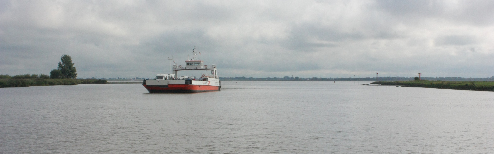
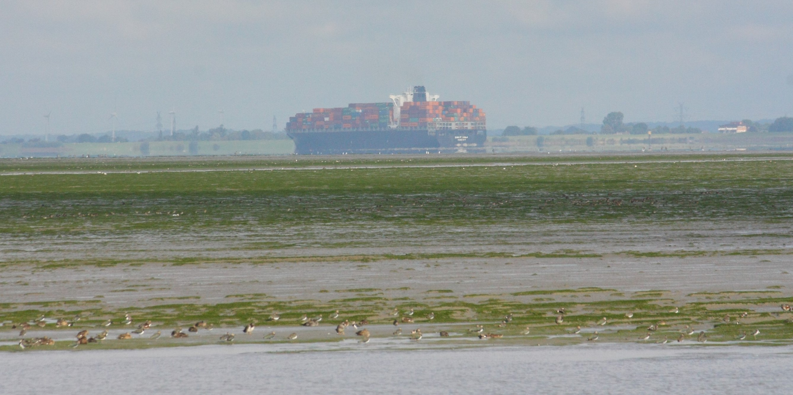
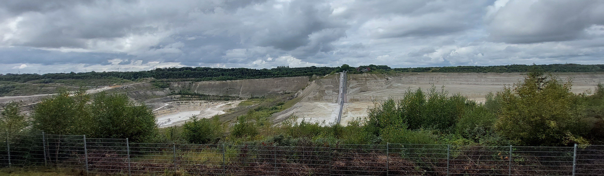
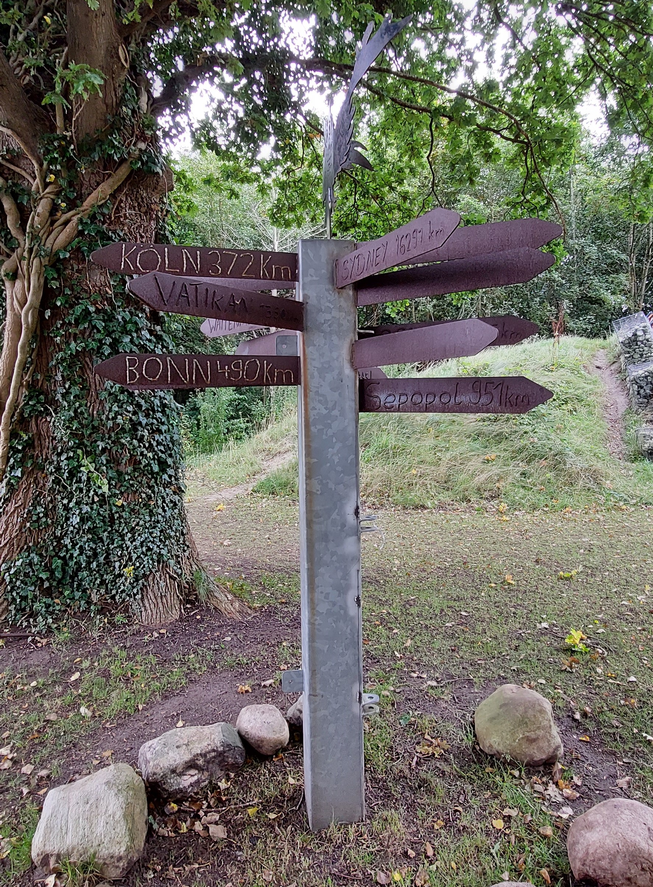
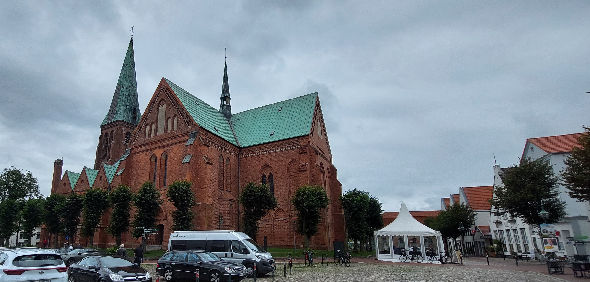
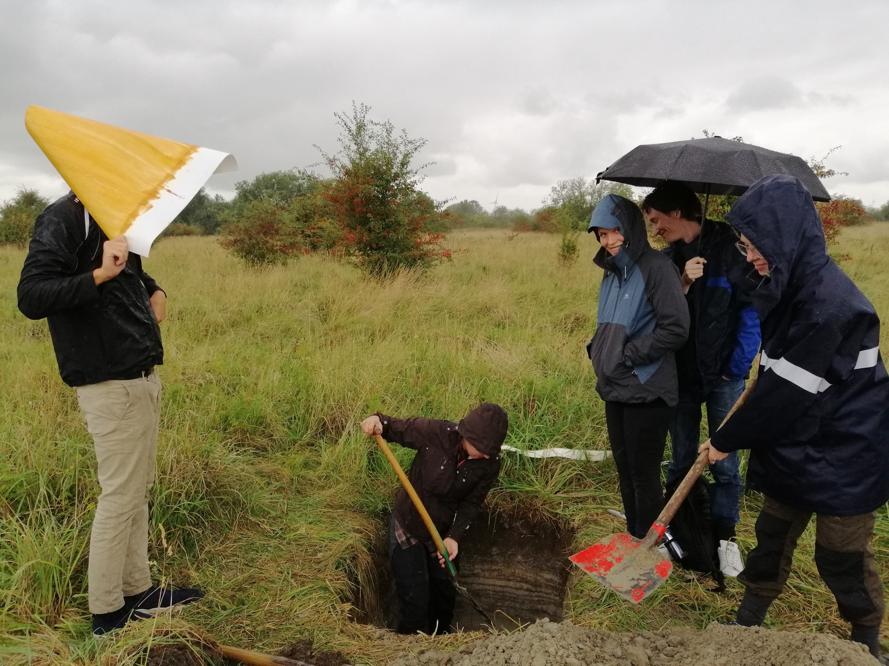
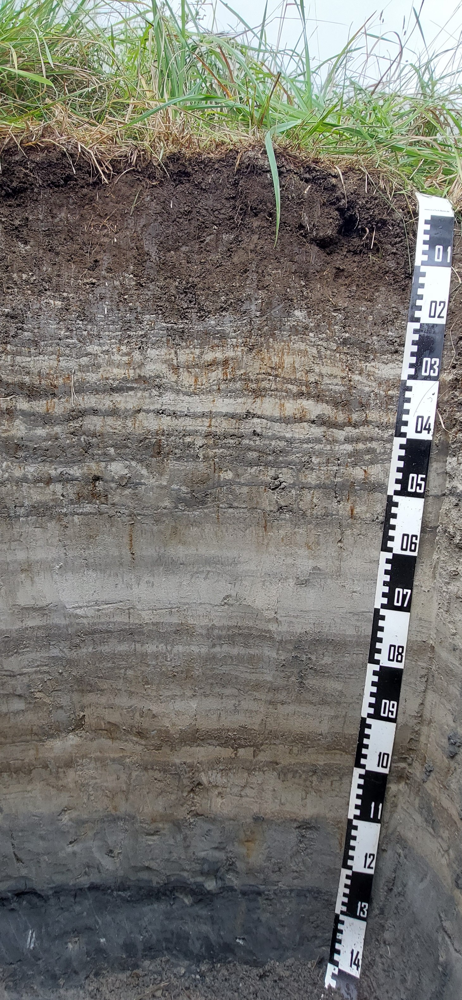

# Samstag, 18.09.2021

<div style="text-align: justify">

Abfahrt: Jugendherberge Stade

Standorte: Elbüberquerung, Kreidegrube Lägerdorf, Meldorf, Speicherkoog

Ankunft: Jugendherberge Heide

</div>

## Elbüberfahrt Wischhafen – Glücksstadt (Jana)

<div style="text-align: justify">

Nach einem für einige ExkursionsteilnehmerInnen feuchtfröhlichen Abend auf dem Stader „Craft Beer & Gourmet-Festival“ am Burggraben und einer zu Teilen weniger erholsamen Nacht in der [Jugendherberge Stade](https://www.jugendherberge.de/jugendherbergen/stade-551/portraet/) startete unsere Weiterfahrt etwas verspätet gegen 09:00 über Wischhafen, Glückstadt, Lägerdorf und den Speicherkoog Dithmarschen in Richtung unserer nächsten Unterkunft.

```{r, echo=FALSE, out.width="100%", fig.cap="Elbfähre Wischhafen - Glückstadt."}

```

Eine Stunde Autofahrt später, erreichten wir Wischhafen und setzten nach einiger Wartezeit mit der Autofähre nach Glückstadt über. Während wir die Grenze zwischen Niedersachsen und Schleswig-Holstein überfuhren, sahen wir aus einiger Entfernung das Kernkraftwerk Brokdorf. Hier wurde von 1986 an Energie für die Versorgung diverser Haushalte erzeugt. Das Kraftwerk wurde am 31.12.2021 abgeschaltet und soll in den kommenden Jahren zurückgebaut werden. Während der Laufzeit zählte das Kraftwerk Brokdorf mehrfach zu den erzeugungsstärksten Kernkraftwerken weltweit (PreußenElektra GmbH 2022).

Containerschiffe, deren gigantische Ausmaße auf Entfernung nur zu erahnen sind, haben außerdem unser Interesse geweckt. Diese großen „Pötte“, wie die Frachtschiffe regional auch genannt werden, haben sich durch ihre Größe eindrucksvoll von dem umgebenden Flachland abgehoben. Im Rahmen der Fahrrinnenanpassung der Elbe – umgangssprachlich auch als Elbvertiefung bezeichnet – werden seit dem 19. Jahrhundert enorme Massen an Schlick und anderen Sedimenten ausgehoben und innerhalb von Unterwasserverbringungsstandorten entlang der Elbe oder im Mündungsbereich der Elbe in das Schleswig-Holsteinische Wattenmeer verbracht. Bereits lange vor den ersten Vertiefungen der Fahrrinne, wurde die Elbe durch den Bau von Deichen begradigt. Der Überflutungsraum der natürlichen Elbe wurde seit Beginn der anthropogenen Baumaßnahmen um 98 % reduziert. Durch diese tiefgreifende Umstrukturierung der Flussdynamik, akkumuliert sich das mit dem Flutstrom ins Landesinnere transportierte Sediment, sodass es vermehrt zu Sedimentation und Verlandung flacher Elbrandbereiche kommt (Eichweber 2007). Es resultiert die Notwendigkeit des anthropogenen Strombaus, sollte die Hauptrinne der Elbe in der heutigen Form erhalten bleiben. Neben dem Erhalt der Stromrinne geht es heute jedoch auch um eine fortlaufende Vertiefung der Fahrrinne. 

Nach mehreren Ausbauphasen ist die Elbe heute tideunabhängig von Schiffen mit einem Tiefgang von bis zu 12,7 m bis zum Hamburger Hafen befahrbar. Um die Fahrtiefe für die immer größer werdenden Frachtschiffe langfristig zu garantieren, ist jedoch zusätzlich ein dauerhafter Ausbau der Fahrrinne von Nöten, da verbrachtes Sediment mit dem Flutstrom flussaufwärts transportiert und erneut in der Fahrrinne sedimentiert wird. Dieser stetig notwendige Einsatz von Baggerschiffen wird auch als Kreislaufbaggerung beschrieben (Eichweber 2007). Der aktuellste, neunte Fahrrinnenausbau umfasst neben einer weiteren Vertiefung und Verbreiterung der Fahrrinne, die Errichtung einer Begegnungsbox sowie eines Warteplatzes (WSV 2022). Der Hamburger Hafen ist der größte deutsche Seehafen und nach Rotterdam und Amsterdam drittgrößter Hafen Europas. In den letzten Jahren ist der Containerumsatz in Hamburg jedoch deutlich zurück gegangen. Ein Ausbau der Fahrrinne ist laut Befürwortern für die Wettbewerbsfähigkeit des Hamburger Hafens sowie als „Jobmotor“ für ganz Deutschland unumgänglich, wird von diversen Umweltschutzorganisationen, wie beispielsweise dem WWF, jedoch als extrem kritisch gesehen (WWF 2022). 

Die Umweltschäden, die durch die Baumaßnahmen und die anthropogene Überprägung der Unterelbe entstehen, sind zu großen Teilen nicht reversibel. Einer der offensichtlichsten Kritikpunkte ist der Verlust ökologischer Nischen. Die Gewässergüte verschlechtert sich durch die baulichen Maßnahmen enorm. Beispielsweise sorgt der stetige Abbau von Schlick und Sediment zu einer Trübung des Wassers. Zusätzlich zu dem, durch die Vertiefung gesteigertem Wasservolumen, bewirkt diese einen Licht- und Sauerstoffmangel in den tieferen Wasserschichten. Insbesondere in den Sommerhalbjahren hat der BUND einen kritischen Sauerstoffmangel von weniger als 3 mg/L nachgewiesen. Damit ist der Sauerstoffgehalt für viele elbbewohnende Tierarten nicht mehr ausreichend. Langfristig kann es zu einer reduzierten Aktivität von Mikroorganismen, der Anreicherung organischer Abfallprodukte und letztendlich zur Eutrophierung kommen (BUND 2021, Schöl et al. 2018). Das vergrößerte Wasservolumen bewirkt außerdem ein weiteres Vordringen des Salzwassers ins Landesinnere und somit einen gesteigerten Salzgehalt, der sich negativ auf seltene ökologische Nischen auswirkt. Auch der Tidenhub nimmt zu. 2019 betrug er 3,90 m und hat sich damit im Vergleich zum natürlichen Tidenhub vor 1850 fast verdoppelt. Damit steigt die Erosivität der Elb- und Tidenströmung und sorgt zusätzlich zu einem hohen Sedimenttransport sowie einer hohen Sedimentationsrate. Dieses Phänomen wird auch als Verschlickung beschrieben. Neben den Schäden für die Umwelt und Artenvielfalt, wird von vielen Anwohnern die Lärmbelästigung sowie der ständige Anblick der großen Frachtschiffe als störend beschrieben.
Laut dem Projektbüro Fahrrinnenanpassung aus dem Jahre 2006 seien „die negativen Umweltwirkungen der Fahrrinnenanpassung […] überwiegend von geringem Ausmaß“ und könnten ausgeglichen werden. Dazu sind verschiedene Kompensationsgebiete, regelmäßiges Monitoring sowie eine Extensivierung der elbnahen Landwirtschaft geplant (Projektbüro Fahrrinnenanpassung 2007). 

Ob die Argumente für oder gegen die Elbvertiefung überwiegen, wird wohl noch lange Thema sein. In jedem Fall sollten die Umweltschäden so gering wie möglich gehalten und neben den wirtschaftlichen Interessen nicht übersehen werden.

```{r, echo=FALSE, out.width="100%", fig.cap="Blick auf ein Containerschiff. Im Vordergrund sind unterschiedliche an der Elbe heimische sowie Zugvögel zu erkennen."}

```

**Abbildung (XY)** zeigt eindrücklich den Konflikt zwischen dem wirtschaftlichen Interesse und dem Wert der Elbe als Ökosystem für verschiedene Vogelarten. Im Vordergrund sind unterschiedliche Vogelarten zu sehen. Leider konnten wir die genaue Vogelart nicht bestimmen. Möglicherweise handelt es sich um Spießenten oder Pfuhlschnepfen. Spießenten überwintern häufig ab September an den Küsten des norddeutschen Tieflandes. Laut NABU (2016) wird die Spießente in Deutschland zur Kategorie 3 der Roten Liste der bedrohten Tierarten aufgeführt. Damit zählt sie zu den gefährdeten Arten, deren Population durch den anthropogenen Eingriff zurückgeht und ohne Schutzmaßnahmen langfristig zu einer schwerwiegenden Bedrohung der Art führen kann. Die Pfuhlschnepfe nutzt das Wattenmeer als Zwischenstopp in ihre Winterquartiere in Westeuropa und Afrika (NABU 2022). Im Hintergrund von ist ein aus Hamburg laufendes und beladenes Containerschiff zuerkennen. Wir ließen diese Eindrücke sowie die in den vergangenen Tagen Erlebnisse auf uns wirken und genossen bei einer Bockwurst die restliche Überfahrt über die Elbe.

</div>

**Quellen**

BUND – Bund für Umwelt und Naturschutz Deutschland e. V., 2021. Sauerstoffmangel durch die Elbvertiefung. https://www.bund-hamburg.de/themen/umweltpolitik/elbvertiefung/sauerstoffloch/, 2022-01-30.

Eichweber, G., 2007. Wasserbauliche und ökologische Bewertungskriterien für Umlagerungsstrategien in der Unterelbe. Rostocker Meeresbiologische Beiträge 17, S. 19 – 37.

NABU – Naturschutzbund Deutschland, 2016. Rote Liste der Brutvögel. https://www.nabu.de/tiere-und-pflanzen/voegel/artenschutz/rote-listen/10221.html, 2022-01-30.

NABU – Naturschutzbund Deutschland, 2022. Pfuhlschnepfe. https://www.nabu.de/tiere-und-pflanzen/voegel/portraets/pfuhlschnepfe/, 2022-01-30.

PreußenElektra GmbH, 2022. Kernkraftwerk Brockdorf. https://www.preussenelektra.de/de/unsere-kraftwerke/kraftwerkbrokdorf.html, 2022-01-30.

Projektbüro Fahrrinnenanpassung, 2007. Fahrrinnenanpassung Unter- und Außenelbe Das Projekt im Überblick. DruckVerlag Kettler, Bönen.

Schöl, A., Hein, B., Wyrwa, J., Kirchesch, V., 2018. Langzeitmodellierung der Gewässergüte in der Elbe mit Fokus auf die Sauerstoffbilanz im Ästuar. Die Küste 86, S. 219 – 250, Karlsruhe.

WSV – Wasserstraßen- und Schifffahrtsverwaltung des Bundes, 2022. Baumaßnahmen – So vertiefen und verbreitern wir die Elbe. https://www.fahrrinnenanpassung.de/bauma%C3%9Fnahmen.html, 2022-01-30.

WWF – World Wide Fund For Nature, 2022. Die Folgen der Vertiefung für Fluss und Umwelt. https://www.wwf.de/themen-projekte/projektregionen/tideelbe/folgen-fuer-fluss-und-umwelt, 2022-01-20.

## Kreidegrube Lägerdorf (Jana)

<div style="text-align: justify">

In Glückstadt angekommen, ging unsere Fahrt zügig weiter nach Lägerdorf, wo wir uns von einem Aussichtspunkt aus die [Lägerdorfer Kreidegruben](https://www.laegerdorf.de/leben-und-erleben/zu-gast-in-laegerdorf/sehenswuerdigkeiten/kreidegruben/) ansahen. 

```{r, echo=FALSE, out.width="100%", fig.cap="Ausblick vom Aussichtspunkt Lägerdorf auf die Lägerdorfer Kreidegruben. Von links nach rechts: Grube Schinkel, Grube Alsen und Grube Heidestraße."}

```

Um Lage und Mächtigkeit dieses Rohstoffes erklären zu können, ist ein Blick in die Entstehungsgeschichte des norddeutschen Beckens von Nöten. Vor rund 255 Mio. Jahren (Zechstein, Oberes Perm) befand sich das heutige norddeutsche Tiefland als ein abgeschnürtes Randmeer in aridem Klima, sodass Evaporite entstehen konnten. Dazu zählen hauptsächlich Salz, Anhydrit und Kalkstein, die durch das Verdunsten des Meerwassers ausfallen. Während des Zeitalters der Kreide vor rund 140 bis 65 Mio. Jahren entstanden durch das Absterben und anschließende Absinken kleiner Algen, Muscheln und Krebstiere mehrere hundert Meter mächtige Kalksteinschichten am Grunde des zu dieser Zeit vorherrschenden warmen und flachen Meeres. Die liegenden Zechstein-Salzschichten haben eine geringere Dichte als die aufliegenden Gesteine und streben durch den sogenannten Prozess der Halokinese an die Geländeoberfläche. Es folgen Aufwölbungen der Salzvorkommen, die als Salzstöcke oder Salzdiapire bekannt sind (mündl. Kommunikation Exkursionsleitung 2021). Während der quartären Klimaschwankungen (ca. 2,0 Mio. Jahre vor heute bis heute) bewirkten verschiedene erosive Prozesse zu einem Abtrag der aufliegenden Schichten und sorgten dafür, dass die Kreideschichten im Raum Lägerdorf und Umgebung heute oberflächennah vorliegen (Informationstafel Holcim 2021a, Informationstafel Holcim 2021b). Da die Kreidevorkommen an diesem Standort aus bis zu 98 % Calciumcarbonat bestehen und somit äußerst rein sind, ist die Lägerdorfer Kreide ein sehr beliebter Rohstoff für beispielsweise die Zementproduktion (Informationstafel Holcim 2021c). Seit etwa 1740 werden die Kreidevorkommen kommerziell abgebaut und wirtschaftlich genutzt. Die abbauwürdige Fläche beträgt etwa 10 km² und umfasst mehrere Gruben (Holcim 2022, Informationstafel Holcim 2021b).

Direkt am Aussichtspunkt Lägerdorf erinnerte uns ein Wegweiser auf die bereits zurückgelegte Strecke und die Entfernung zu unserer Heimatstadt Köln. 

```{r, echo=FALSE, out.width="50%", fig.cap="Wegweiser am Aussichtspunkt Lägerdorf."}

```

**Quellen**

Exkursionsleitung, 2021. Diskussion über die Entstehung der Kreidevorkommen Lägerdorf.

Holcim, 2022. Geologie und Kreidegewinnung. https://www.holcim.de/de/geologie-und-kreidegewinnung, 2022-01-30.

Informationstafel Holcim, 2021a. Kreidevorkommen rund um Lägerdorf. Öffentliche Information am Aussichtspunkt Lägerdorf.

Informationstafel Holcim, 2021b. Geschichte der Lägerdorfer Kreide. Öffentliche Information am Aussichtspunkt Lägerdorf.

Informationstafel Holcim, 2021c. Rohmaterialgewinnung – Gestern und Heute. Öffentliche Information am Aussichtspunkt Lägerdorf.

</div>

## Meldorfer Bucht (Jana)

<div style="text-align: justify">

Nach einer kleinen mittäglichen Stärkung an der St. Johannis-Kirche in Meldorf – je nach Vorliebe in Form von Pommes, Burger oder Backwaren – ging unsere Reise weiter. 

```{r, echo=FALSE, out.width="100%", fig.cap="St. Johannis-Kirche in Meldorf und Meldorfer Marktplatz."}

```

Wir durchfuhren die sehr markante norddeutsche Marschlandschaft in Richtung Meldorfer Bucht und Nordseeküste während wir durch die Exkursionsleiter erklärt bekommen, wie die Region entstand. Der Landstrich ist von ehemaligen Haupt-, Alt- und Sommerdeichen durchzogen, die die einzigen Erhöhungen in dem sonst sehr flachen Gebiet darstellen. Durch die Eindeichung der flachen, küstennahen, gezeitenbeeinflussten Salzwiesen wurde bereits im 11. Jahrhundert Siedlungs- und Ackerfläche gewonnen. Die natürliche Auflandung meerwärts sowie die Entwässerung der gewonnenen Landflächen verschob die Küstenlinie in mehreren Eindeichungsphasen nach Westen. Diese neuen Flächen werden als Köge (Einzahl Koog) bezeichnet und finden sich in den Namen der umgebenden Orte wieder. Neben dem Zweck der Landgewinnung dienen die Deiche vor allem dem Schutz gegenüber Sturmfluten. Eine der letzten großen Sturmfluten an der deutschen Nordseeküste ereignete sich im Januar 1976. Die kurz zuvor verstärkten Deiche konnten den Fluten jedoch größtenteils trotzen, sodass es zu keinen größeren Schäden kam. Heute bewirken die Deiche auch einen Schutz gegen den, durch den Klimawandel bedingten, Meeresspiegelanstieg. Viele der heutigen Deiche werden jedoch langfristig verstärkt werden müssen (mündl. Kommunikation Exkursionsleitung 2021a).

Die neu entstandene Landschaft wird auch als Marsch, deren Böden als Marschen bezeichnet. Zumeist bildet feinkörniger, sulfidhaltiger Schlick, der je nach Ursprung und Strömung carbonat- oder quarzhaltig und häufig reich an primärer organischer Substanz ist, das Ausgangssubstrat dieser Böden. Während Sturmflutereignissen werden geringmächtige Feinsandstreifen abgelagert. Außerdem können fossile A-Horizonte oder Torfschichten lokal gefunden werden (Amelung et al. 2018). Die Entwässerung der ehemaligen Salzwiesen bewirkt das Einsetzen erster bodenbildender Prozesse und die Entstehung einer Rohmarsch. Das Aufwachsen von Vegetation verhindert Erosionsprozesse und führt zur Entstehung eines humosen Oberbodens. Gleichzeitig wird der Boden besser belüftet, sodass es neben einer Aussüßung und Entkalkung auch zu der Oxidation der Sulfide kommt. Je nach überwiegendem Prozess und Alter der Marsch können neben Kalkmarschen (entsalzt und kalkhaltig), Kleimarschen (entsalzt und entkalkt) und Knickmarschen (verwittert) weitere Formen der Marschböden entstehen, auf die im Folgenden nicht weiter eingegangen werden soll. Es handelt sich zumeist um sehr fruchtbare Böden, die nach Entwässerung und mit entsprechend angepasstem Ackerbau zu den ertragsreichsten Böden Deutschlands zählen (Amelung et al. 2018, mündl. Kommunikation Exkursionsleiter 2021a).

Unser letztes Ziel des Tages war einer der jüngsten Köge der Region: der Speicherkoog. Der nördliche Teil dieses Koogs wurde erst in den Jahren 1974 bis 1978 eingedeicht. Der Name „Speicherkoog“ rührt daher, dass er in Zeiten von hohen Grundwasserständen Wasser speichert. Viele der Köge liegen unterhalb oder nur knapp über dem Meeresspiegel und müssen dauerhaft entwässert werden. Dies ist in den sich regelmäßig wiederholenden Gräben deutlich zu erkennen. Dort sahen wir uns neben der 2010 in Betrieb genommenen Wetterstation den Boden genauer an.

</div>

### Untersuchungsfläche Speicherkoog (Jana)

<div style="text-align: justify">

Von Wildschweinen verfolgt, schaffen wir unsere Ausrüstung auf die naturnahe, etwa 14 ha große Untersuchungsfläche. Die vor Ort installierte Wetterstation nimmt neben der Windgeschwindigkeit und -richtung, die Niederschlagsmenge, Lufttemperatur, relative Luftfeuchte und die Globalstrahlung in stündlicher Auflösung auf. Durch mehrere im Boden installierte Sonden sind außerdem Aussagen über unterschiedlicher Bodenparameter, wie beispielsweise den Grundwasserstand, die Wasserspannung, die Bodentemperatur, das Redoxpotential sowie den Sauerstoffgehalt möglich. Auch hier werden die Daten stündlich genommen. Die Daten beider Stationen werden mittels Datalogger aufgezeichnet und zwei Mal täglich an **xy** gesendet. Die Stromversorgung ist durch ein Solarpanel sichergestellt.

</div>

### Bodenprofil: Kalkmarsch (Jana)

<div style="text-align: justify">

Während ein Teil der Gruppe sich die Wetter- und Bodenstation genauer ansah, begannen die übrigen Studierenden mit dem Ausheben eines Bodenprofils. Es wurde darauf geachtet, möglichst wenig Schäden an der Vegetation zu verursachen. Das ausgehobene Bodenmaterial ist räumlich nach Horizonten getrennt auf einer Plane gelagert worden, um es nach Abschluss unserer Arbeiten möglichst wenig gestört einbauen zu können. Nach einiger Zeit wurden die Aufgaben getauscht und es konnte mit neuer Power weitergegraben werden. Während die Profilgrube Zentimeter um Zentimeter tiefer und der Berg mit ausgehobenem Bodenmaterial immer größer wurde, trotzten wir sowohl kleinen Regenschauern als auch Kristofs Musikgeschmack **Ist das zu böse?**. 

```{r, echo=FALSE, out.width="100%", fig.cap="Gute Laune trotz anstrengender Arbeit und kleinen Regenschauern."}

```

Nach knapp eineinhalb Stunden fleißigen Buddelns und Präparierens hatte unser Bodenprofil eine Tiefe von 1,40 m erreicht. Das fertige Bodenprofil ist in **Abbildung xy** zu sehen. Es handelt sich um eine Norm-Kalkmarsch (nach der deutschen Bodenklassifizierung) bzw. einen Calcaric Fluvisol (nach WRB), die bereits in unterschiedlichen Publikationen von Herrn Mansfeldt (u.a.: Mansfeldt 2003, Mansfeldt 2004) beschrieben und  als Beispielprofil für den [Boden des Jahres 2009](https://boden-des-jahres.de/archiv/2009-stadtboden/) verwendet wurde. Deutlich zu erkennen, sind die charakteristischen Bodenhorizonte.

```{r, echo=FALSE, out.width="40%", fig.cap="Aufgegrabenes Bodenprofil: Norm-Kalkmarsch."}

```

Die oberen 15 cm des Profils umfassen den humosen Oberboden und werden als Ah-Horizont bezeichnet. Dieser entstand durch Humusanreicherung und Erosionsschutz der aufwachsenden Vegetation. Liegend ist ein etwa 10 cm mächtiger Übergangshorizont zu erkennen. Besonders in den oberen Horizonten sind Spuren von biogener Durchmischung der Bodenstruktur zu erkennen. Diesen Prozess fasst man unter dem Begriff der Bioturbation zusammen. Außerdem bewirkt die biologische Aktivität die Entstehung eines Bodengefüges. Im Falle des Oberbodens entsteht hier unter dem Einfluss von Regenwürmern ein Krümelgefüge. Von 25 cm bis 1,1 m Profiltiefe erstreckt sich ein oxidierter, teilweise carbonathaltiger und semiterrestrischer Grundwasserhorizont, der nach der deutschen bodenkundlichen Kartieranleitung (2005) als eGo gekennzeichnet wird. Dieser kann weiter in Unterhorizonte unterteilt werden. Im oberen Bereich sind deutliche Rostflecken zu erkennen. Dies spricht für die Ausfällung und Anreicherung von Eisenoxiden im überwiegend belüfteten Schwankungsbereich des Grundwassers. Die Schichtung, die insbesondere in einer Tiefe von 25 bis 55 cm zu sehen ist, resultiert aus reliktischen Sturmfluten und Überflutungsereignissen. Auch unterhalb von 55 cm können die typischen Bänder durch Sturmfluten erkennt werden, hier jedoch mit etwas größerem Abstand zueinander. Ab einer Profiltiefe von 1,1 m beginnt der reduzierte und zumeist wassergesättigte eGr-Horizont. Dieser ist geprägt durch die dunkelgraue bis fast schwarze Färbung, die durch Eisensulfide entsteht. Mit **10 % -iger Salzsäure haben wir getestet, bis wohin der Boden entkalkt ist. (bis wohin ist er entkalkt?).** Im Verlauf der weiteren Bodenentwicklung wird die vorliegende Kalkmarsch durch Säureeinträge nach und nach entkalkt. Den so entstandenen Boden bezeichnet man als Kleimarsch (mündl. Kommunikation Exkursionsleitung 2021b). 

Das hier vorgestellte Profil zeigt eindrücklich die Relevanz der Böden als Archiv der Naturgeschichte. Ab einer Tiefe von etwa 1,40 m haben wir mehrere teils sehr gut erhaltene Muscheln finden können. Leider können wir sowohl die Art, als auch den genauen Ablagerungszeitraum nicht mehr rekonstruieren. 

**Beschreibung und Alter der gefundenen Muscheln**

Gemeinsam und umgeben von Schafen ließen wir diesen ereignisreichen Tag bei Bier und Fassbrause auf dem Deich der Meldorfer Bucht ausklingen. 

</div>

**Quellen**

Ad-hoc-Arbeitsgruppe Boden: Bundesanstalt für Geowissenschaften und Rohstoffe in Zusammenarbeit mit den Staatlichen Geologischen Diensten, 2005. Bodenkundliche Kartieranleitung, Hannover. 

Amelung, W., Blume, H.-P., Fleige, H., Horn, R., Kandeler, E., Kögel-Knaber, I., Kretzschmar, R., Stahr, K., Wilke, B.-M., 2018. Scheffer/Schachtschabel Lehrbuch der Bodenkunde. 17. Auflage. Springer Spektrum, Berlin.

Exkursionsleitung, 2021a. Gespräch über die Entstehungsgeschichte der Melddorfer Bucht sowie der Eindeichungsgeschichte der Köge.

Exkursionsleitung, 2021b. Gespräch über die vorgefundene Kalkmarsch.

Mansfeldt, T., 2004. Redox potential of bulk soil and soil solution concentration of nitrate, manganese, iron, and sulfate in two Gleysols. Journal of Plant Nutrition and Soil Science 167, S. 7 – 16.

Mansfeldt, T., 2003. In situ long-term redox potential measurements in a dyked marsh soil. Journal of Plant Nutrition and Soil Science 166, S. 210 – 219.
