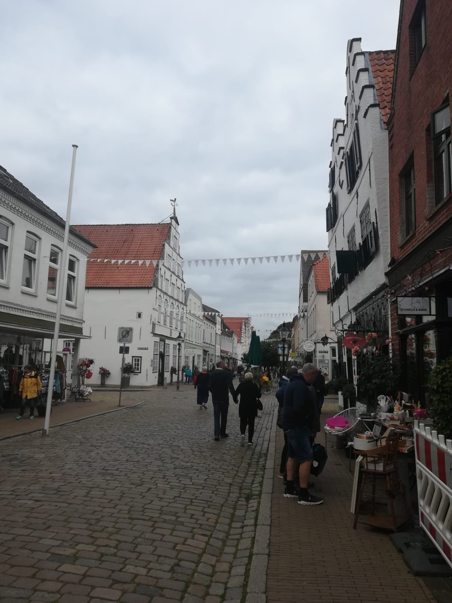
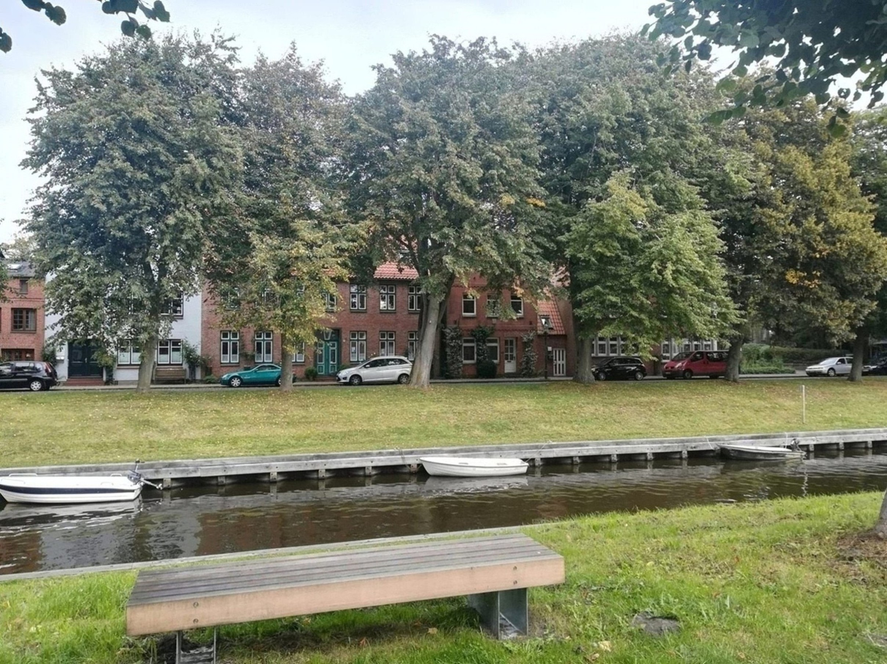
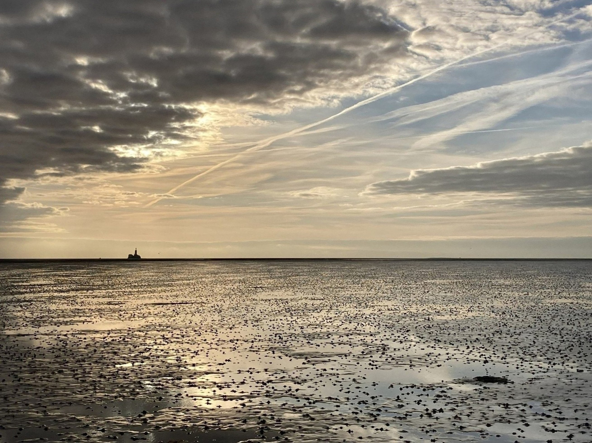
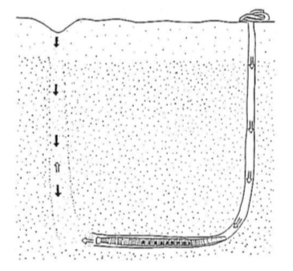
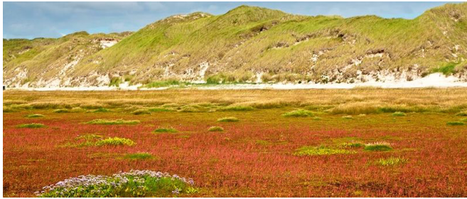

# Sonntag, 19.09.2021

Abfahrt: Jugendherberge Heide

Standorte: Kleve, Eidersperrwerk, Friedrichstadt, Wattwanderung

Ankunft: Jugendherberge Heide


## Waschsalon und Südfriedhof Heide (Jana)

<div style="text-align: justify">

Dieser Sonntagvormittag stand den ExkursionsteilnehmerInnen zur freien Verfügung. Der Großteil entschied sich dazu einen nahegelegenen Waschsalon zu besuchen, um die restlichen Exkursionstage in frischer Bekleidung genießen zu können. Während die Waschmaschinen ihre Arbeit machten, entschließ sich ein kleiner Teil der Gruppe zu einem kleinen Spaziergang über den nahegelegenen Südfriedhof der Gemeinde Heide. Neben einigen weiteren Denkmalen wird hier den verstorbenen Zwangs- und Fremdarbeitern in Heide und Umgebung 1941 – 1945 gedacht. Auf dem Rückweg trafen die Studierenden zufällig den ehemaligen Friedhofsverwalter und seine Frau, die wie jeden Sonntag dem Südfriedhof einen Besuch abgestattet haben. Wird unterhielten uns einige Zeit mit beiden über die Geschichte der Region sowie den Zweck unserer Reise. Nach dieser sehr interessanten Begegnung machten wir uns mit frisch gewaschener Kleidung auf den Rückweg zu unserer Unterkunft und starteten in einen interessanten Nachmittag. 

</div>


## Besuch von Kleve und dem Eidersperrwerk (Florian)

<div style="text-align: justify">
Am siebten Tag unserer Exkursion ging es zuerst nach Kleve wo wir an einem Reiterhof haltmachten. Hier nannte uns Herr Mansfeldt ein paar Informationen. 
Der Ort hat seinen Namen vom Wort „Kliff“ und ist eine ehemalige Steilküste, die aus der Endmoräne der Saale-Eiszeit hervorgeht. Sie setzt sich aus Warthestadiummaterial zusammen. Der Meeresspiegel war deutlich niedriger, es gab mehrere Transgressionen, Niederungen erstrecken sich entlang der Flüsse der Eider. Die Nährungen werden auch als „Donn“ bezeichnet. Donn liegen an einem Näherungsharken.
Von Kleve geht es weiter zum [Eidersperrwerk](https://www.spo-eiderstedt.de/poi/eidersperrwerk). Dort machten wir eine kleine Pause um die schöne Aussicht zu genießen. Auch für ein Fischbrötchen war Zeit genug. Das Sperrwerk verbindet den Kreis Dithmarschen mit Eiderstedt in Nordfriesland und wurde aufgrund der großen Sturmflut 1962 errichtet. Der Bau dauerte sechs Jahre und wurde 1973 fertiggestellt. Danach ging es weiter nach Friedrichstadt. 

</div>

**Quellen**

Stadt Eiderstedt, 2021. Abrufbar unter: https://www.spo-eiderstedt.de/poi/eidersperrwerk. Letzter Zugriff am 05.01.2022


## Friedrichstadt (Florian)

<div style="text-align: justify">

In Friedrichstadt machten wir halt um uns den kleinen Ort anzuschauen. Im 17. Jahrhundert sollte hier eine neue [Handelsmetropole](https://www.nordseetourismus.de/friedrichstadt)
entstehen. Stadtgründer Herzog Friedrich III von Schleswig-Gottorf holte dafür viele niederländische Bürger in die Stadt, was man auch unweigerlich am Stadtbild erkennen kann, sieht die die Stadt doch aus wie „Klein-Amsterdam“.

```{r, echo=FALSE, out.width="80%", fig.cap="Friedrichstadt – oder auch Klein-Amsterdam"}

```

Statt Tulpen gibt es hier jedoch viele Rosen zu begutachten. Zudem verlaufen holländische Grachten durch die Stadt. Bei unserer kleinen Tour sehen wir viele Kanufahrer und kleine Boote. Bei schönem Wetter und einer Fülle an Menschen genossen wir beispielsweise unsere Poffertjes, echt holländisch halt.

```{r, echo=FALSE, out.width="40%", fig.cap="Grachten in Friedrichstadt"}

```

</div>

**Quellen**

Nordseetourismus Friedrichstadt, 2021. Abrufbar unter: https://www.nordseetourismus.de/friedrichstadt. Letzter Zugriff am 05.01.2022.


## Wattwanderung (Florian)

<div style="text-align: justify">
Der Sonntag wurde am späten Nachmittag durch eine Wattwanderung abgerundet. Die Fahrt dorthin dauerte knapp zwei Stunden. Nach einer kurzen Stärkung durch Fischbrötchen trafen wir uns mit einer alten Bekannten von Herrn Mansfeldt, die uns durch das Wattenmeer begleitete. Das Wattenmeer setzt sich aus dem südlichen, mittleren und nördlichen Meer zusammen und erstreckt sich von den Niederlanden, über Deutschland bis nach Dänemark. 

Die Lebensräume des Wattenmeers bilden ein komplexes System, das sich aus verschiedenen Gradienten zusammensetzt, wie Wassertiefe und Salzgehalt, Höhenlage und Trockenheit, Einwirkung durch hydrodynamische Prozesse und Wind sowie durch Organismen veränderte Substrate (Common Wadden Sea Secreteriat, 2021). Es gibt ein reichhaltiges Nahrungsangebot für Fische, Vögel und Schalentiere. Die wichtigsten Lebensräume des Wattenmeers sind auf einer Linie ausgehend vom offenen Meer bis hin zur Küste angeordnet. Sie reichen von tiefen tidengeprägten Rinnen und Prielen bis zu den höchsten Dünen.
Das dem Wattenmeer vorgelagerte Meer ist frei von Wattflächen. Im Gezeitengebiet findet ein ständiger Austausch von Wasser und Sedimenten statt. Häufig kommt es zu massivem Wachstum an Phytoplankton, da die Trübheit gering genug ist, um ausreichend Licht durchzulassen (Common Wadden Sea Secreteriat, 2021).

In der Gezeitenzone liegen mit den Wattflächen die markantesten Lebensräume.
Bei Ebbe trifft das Meer auf den Horizont und lädt den Besucher zu einer Wattwanderung ein, wenn mehr als die Hälfte der Wattflächen frei liegen. Zahlreiche Rinnsale, einige Priele und tiefe Fahrrinnen durchtrennen jedoch das Watt und können einem den Weg abschneiden.

```{r, echo=FALSE, out.width="60%", fig.cap="Wattenmeer"}

```

Die Oberfläche ist fast vollständig von kleinen Algen- und Bakterienkolonien überzogen. In überspülten Seegrasbereichen sammeln sich feine Partikel an. Vor dem Auge verborgen wirken Wattwürmer, die mit über einer Milliarde Individuen die weltweit größte Wurmpopulation stellen. 
Die durch den Wattwurm kontinuierliche Aufarbeitung der Sedimente sorgt dafür, dass das Sandwatt sandig bleibt und nicht zum Schlickwatt wird. Er ist einer von vielen Tierarten, die durch ihr permanentes Filtrieren das Wasser und Sediment von Partikeln befreien (Common Wadden Sea Secreteriat, 2021).

Der Wattwurm lebt in einer J-förmigen Röhre, in der er einen ständigen Wasserstrom erzeugt, der für frischen Sauerstoff und Nährstoffzufuhr sorgt. Mit seinem Rüssel nimmt er Sediment mit den darin enthaltenden Bakterien, Algen und organischem Material auf.

```{r, echo=FALSE, out.width="40%", fig.cap="J-Röhre des Wattwurms"}

```

Die Salzwiesen bilden die Übergangszone zwischen Meer und Land (lebensraum-wattenmeer, 2021). Sie bestehen aus natürlichen Weideflächen mit einer großen Vielfalt an wunderschönen, lebensraumspezifischen Pflanzen. Salzwiesen weisen einen großen Reichtum an Blumen auf. Sie bieten eine vielfältige Mischung an spezialisierten Pflanzen ebenso wie Generalisten, die an die Lebensbedingungen angepasst sind. Bei jeder Überflutung der Salzwiese bleibt etwas Sediment zurück, wodurch der Lebensraum mit der Zeit größer wird. Aus diesem Grund können Salzwiesen dem Anstieg des Meeresspiegels weitgehend widerstehen, da in beiden Fällen das Anwachsen etwa gleich schnell erfolgt.

```{r, echo=FALSE, out.width="40%", fig.cap="Salzwiese"}

```

Die Lebensräume des Wattenmeers bieten eine große Vielfalt an Arten (Common Wadden Sea Secreteriat, 2021). Von den 10.000 im Wattenmeer vorkommenden Pflanzen- und Tierarten leben etwa 2.700 im Meer und mindestens 5.100 sowohl im Meer als auch an Land oder ausschließlich an Land. Dazu gibt es verschiedene Gruppen an Einzellern und kleinen Metazoen. Phototrophe Pflanzen sind mit etwa 2.300 Arten vertreten, Großpilze mit 1.300 und Tiere mit 4.200 Arten. 

Nach der rund neunzig minütigen Wanderung ging es zurück zum Auto, wo wir gemeinsam ein erholsames Bier tranken. Anschließend fuhren wir zurück zu unserer Unterkunft. Dort angekommen, spielten wir zu fünft eine spannende Partie Straßenschach bis in die frühen Morgenstunden. 

**Quellen**

Common Wadden Sea Secreteriat,2021. Abrufbar unter: https://www.waddensea-worldheritage.org/de/unser-welterbe. Letzter Zugriff am 30.11.2021.

Lebensraum Wattenmeer, 2021. Abrufbar unter: https://www.lebensraum-wattenmeer.de. Letzter Zugriff am 30.11.2021.

</div>

