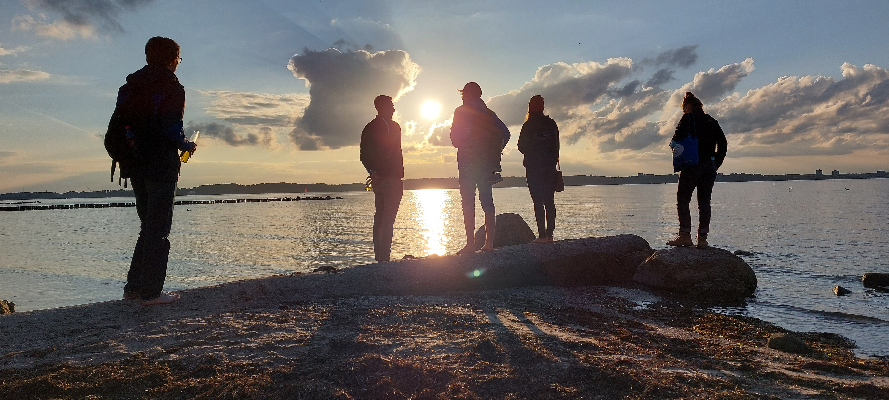

# Tag 8 - Todendorf Führung, Laboe

## Todendorf (Julia)
<div style="text-align: justify">

Unser Ziel für die nächsten zwei Nächte war ein auf dem ersten Blick wohl ungewöhnliches Ziel für eine Geographie-Exkursionsgruppe: der Truppenübungsplatz Todendorf. Er liegt im Kreis Plön an der schleswig-holsteinischen Ostseeküste und ist eigentlich keine eigenständige Anlage, sondern eine Außenstelle der übergeordneten Truppenübungsplatzes Putlos, dessen Übungsgelände sich insgesamt von der Wagrien-Kaserne westlich von Oldenburg bis an die Hohwachter Bucht erstreckt. Es umfasst insgesamt rund 12 Quadratkilometer Land und etwa 480 Quadratkilometer Schießgebiet auf See (Bundeswehr 2022).

Putlos wurde 1935 errichtet und nach Verwaltung durch die Britische Armee 1945-1947 am 1. November 1957 wieder durch die Bundeswehr übernommen (Bundeswehr 2021). Sein Gelände wird heute vor allem durch Einheiten und Verbände von Marine und Luftwaffe genutzt, denen sich mit Putlos als deutschlandweit einzigem Truppenübungsplatz mit Küstenanbindung besondere Möglichkeiten bieten. Für die Luftwaffe liegt der Schwerpunkt hier im Flugabwehrschießen, im Luft-See-Schießen und im Close Air Support, während die Marine durch die besondere Lage des Platzes nahezu unbegrenzte Möglichkeiten in der Durchführung von bspw. Triphibischen Operationen, See-See-Schießen und See-Land-Beschuss hat (Bundeswehr 2022). 

Bei unserer Ankunft in Todendorf wurden wir von Horst begrüßt, der dort für die Landschaftspflege zuständig ist und sich uns für die Zeit unseres Aufenthalts freundlicherweise als persönlicher Kontakt und Experte bereitstellte.  Um das Gelände betreten zu dürfen meldeten wir uns am bewachten Schalter an und tauschten unsere gesammelten Personalausweise gegen einen Besucherausweis ein, den wir stets bei uns tragen mussten. Hier bezogen wir zunächst unsere Zimmer in einem der Kasernengebäude, das für BesucherInnen zur Verfügung steht. Wir als ZivilistInnen und universitäre Exkursionsgruppe gehörten dabei zu einer wohl sehr unüblichen Gäste-Kategorie, denn außer uns waren auf dem Platz nur SoldatInnen untergebracht. Da keine/r der TeilnehmerInnen unserer Exkursion bisher Erfahrungen bei der Bundeswehr gesammelt hatte, faszinierte der Kasernenflair mit dem langen, zugigen Flur und den in den Zimmern eng stehenden Betten uns alle und bot eine interessante Erweiterung zu unserem bisherigen Unterkunfts-Repertoire.  

Nachdem wir die Zimmer weitestgehend bezogen hatten, gab Horst uns zunächst eine Rundführung über das ca. drei Quadratkilometer große Kasernengelände und seine Landschaftsflächen. Da das Fotografieren auf dem Bundeswehrgelände nicht erlaubt war, unterließen wir das auch während unserer Führung über das Gelände. Am Kiesstrand beobachteten wir zunächst Land-See Schießübungen auf dem Meer. Besonders beeindruckte uns dabei die zeitliche Verzögerung des durch einen Wasserkegel sichtbaren Einschlags auf See und des etwa 13 Sekunden später bei uns ankommenden Schalls der Detonation. Nachdem er uns hier schon den seltenen und unter Naturschutz stehenden Seekohl zeigte,  führte Horst uns in das Gelände hinein.

Manch einer mag bei dem Gedanken an die Natur auf militärischem Gelände wie Todendorf zunächst an Munitionsreste oder Schwermetallbelastung denken – was Horst uns mit der Aufforderung, uns bei der Begehung an ihn zu halten und nichts vom Boden aufzuheben, was nach Munitionsrest o.ä. aussieht, als durchaus berechtigte Punkte bestätigte. Neben ihrer militärischen Relevanz sind Truppenübungsplätze aber auch relevant für den Naturschutz, denn „als letzte unzerschnittene Gebiete Mitteleuropas“ sind sie eine ökologische Besonderheit und bekannt für ihre Artenvielfalt in Flora und Fauna (NABU 2022b). Da sie als militärische Sperrzonen über Jahrzehnte großräumig eingezäunt sind und über diese Zeit ausschließlich durch die Bundeswehr genutzt werden, sind sie weder von Siedlungsbau oder Flächenversiegelungen betroffen, noch werden sie durch Straßen oder Bahnlinien durchbrochen. Da auf ihnen auch keine Landwirtschaft betrieben wird, sind die Flächen auch nicht durch Pestizide oder Dünger belastet. Die Natur kann sich also über sehr lange Zeiträume weitgehend unberührt entwickeln (Willinger 2019). Horst demonstrierte uns das anhand zwei sehr alter Eichen, die vor einem ehemaligen Gehöft stehen und zeigte uns im Laufe der Begehung zahlreiche seltene Kräuter und Wildblumen. 

Auch Tiere finden auf dem Gelände sehr günstige und geschützte Lebensbedingungen vor. Noch im Bus begegneten wir direkt zu Beginn unserer Führung einer überraschend zahm erscheinenden Damwild-Gruppe, die sich auch von unserer Vorbeifahrt in unmittelbarer Nähe nicht aus der Ruhe bringen ließ. Laut Horst versuchen außerdem immer wieder Hirsche von außen in das Gelände hineinzukommen und zerstören dabei die Umzäunung des Gebiets. Das Gelände bietet außerdem ein Brutgebiet für eine Gruppe Kormorane, eine Vogelart, die nach massiver Verfolgung in der ersten Hälfte des vergangenen Jahrhunderts schon einmal als beinahe ausgerottet galt (NABU 2022a). Sie brütet in den Bäumen rund um einen kleinen Teich und wurde durch ihre Großzahl sogar zur ökologischen Belastung: die Exkremente der Vögel verätzen die den Teich umgebenden Bäume und tragen außerdem stark zur Eutrophierung des Gewässers bei, das wir als mittlerweile grün leuchtend wahrnehmen. Eine Lösung dafür ist noch nicht in Sicht, da man den Kormoranen nicht schaden will. Trotzdem soll in Zukunft an diese Herausforderung herangegangen werden. 

</div>

## Laboe

<div style="text-align: justify">
Nach der Todendorf Führung ging es für uns abends nach Laboe, wo wir ein Picknick im Sand veranstalteten. Mit fabelhaftem Blick auf das Meer. Trotz des kühlen Windes wagte sich Christian ins Wasser, wenn auch nicht für lange. 


Wir haben Brot, allerlei Snacks und natürlich ein kühles Blondes. Anschließend machten wir einen Strandspaziergang, bei dem wir auch kurz am Marine-Ehrenmal vorbeikamen.  

Das 1936 fertig gestellte 85 Meter hohe [Marine-Ehrenmal]( https://deutscher-marinebund.de/marine-ehrenmal-u-995/marine-ehrenmal/) ist eine internationale Gedenkstätte für die auf See Gebliebenen aller Nationen und ein Mahnmal für eine friedliche Schifffahrt auf freien Meeren. Heute stellt das Ehrenmal eine internationale Mahn- und Gedenkstätte dar, die jedes Jahr während der Kieler Woche mit einer internationalen Kranzniederlegung gewürdigt wird.

Der Rückweg folgte auf der Promenade, begleitet von einem traumhaften Sonnenuntergang.


```{r, echo=FALSE, fig.cap="Am Strand in Laboe bei Sonnenuntergang"}

```


</div>


