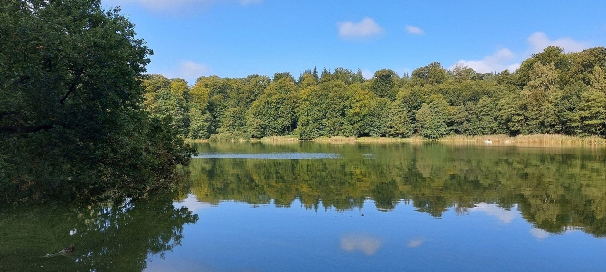

# Mittwoch, 22.09.2021 - Die Glaziale Serie 

## Aufbruch

Am 10. Tag brach die Gruppe frühmorgens ihr Lager in der Bundeswehrkaserne ab und machte sich auf den weiten Weg nach Mecklenburg zum Strandort Warnemünde. Die Landschaft die auf der Fahrt durchquert wurde war dabei die Hauptattraktion des Tages. Auf dem Weg richtung Osten durchquerte die Gruppe nämlich das östliche Hügelland, auch als Holsteinische Schweiz bekannt.
Die Straßen die der Kleinbus unserer Gruppe entlangfuhr schlängelten sich durch malerische, hügelige Landschaften mit üppigen Feldern und grünen Weiden, wie man sie sonst vielleicht aus Werbeprospekten des Voralpenlandes kennt.  

Das Vorfinden einer solchen Landschaft im eigentlich für seine weiten Horizonte bekannte Norddeutschland mag zunächst verwundern, ein Blick in die (geologische) Vergangenheit sorgt jedoch für Erklärung. Die Holsteinsche Schweitz ist nämlich genau wie das Alpenvorland eine Jungmoränenlandschaft aus der letzten Kaltzeit, der Würm bzw. Weichselkaltzeit.

## Die Glaziale Serie in Norddeutschland

Ganz Nordeutschland, beziehungsweise die sehr bezeichnende Norddeutsche Tiefebene, ist durch die Gletscher der letzten großen Kaltzeiten geprägt. Von Skandinavien kommend rollten sich dabei kilometerhohe Gletscher über das Land, welche sämtliche Bodenschichten bis auf das Grundgestein hinwegschleiften. Deshalb kann man in Norddeutschlad Erdgeschichlich auch nur bis in die letzten drei Kaltzeiten blicken, die Weichsel, Saale und Elster- Kaltzeiten. 

Die Böden sind  daher auch durch die glazialen und periglazialen prozesse dieser Zeit geprägt und bestehen aus dem von den Gletschern mitgetragenem Gestein (Geschiebemergel) in verschiedenen Erosionsstadien. Nun stießen die Gletscher der Weichselkaltzeit allerdings lange nicht so weit vor wie die der vorangegangen Saale-Eiszeit wie auf den beiden untenstehenden Karten zu sehen ist. 

{width=100%}

Wie man sieht liegt der maximale Vorstoß der Gletscher der Weichselkaltzeit ziemlich mittig durch schleswig-Holstein von Nord nach Süd.
Bei ihrem Zurückschmelzen am Ende der Weichselkaltzeit vor etwa 12.000 Jahren hinterließen sie daher die aufgeschütteten Endmoränen und die Spuren ihrer Schmelzwasserflüsse an eben dieser "Grenze", wodurch sich das östliche Hügelland in Schleswig Holstein gebildet hat.
Dadurch sind die Landschaftsformen in SH zweigeteilt, mit dem Weichselzeitlich geprägtem Östlichen Hügelland als Jungmoränengebiet im Osten, und den Saalezeitlichen Sanderflächen der Geest und der Altmoränen im Westen.

## Der Bungsberg

Die hinterlassenen Spuren der Gletscher können auf relativ komplexe Landschaftsformen zurücklassen. So auch der Bungsberg, mit 167,4 metern der höchste Hügel schleswig-Holsteins. Obwohl weit im Östlichen Hügelland gelegen, geht dieser vermutlich auf eine Saalezeitliche Endmoräne zurück, da das Material bzw. Sediment aus dem er besteht sich von dem umliegender Hügel unterscheidet. Die späteren weichselzeitlichen Gletscher konnten dann Aufgrund seiner Höhe nur um ihn herumfließen. Der Wissenschaftliche Begriff hierfür ist "Nunatak" was aus dem Grönländischen stammt, wo entsprechende Formationen naturgemäß sehr häufig sind.

Die Gruppe machte hier einen längeren Halt und bestaunte die Aussicht. Dies war auch der Moment an dem der Gruppe ein für alle mal bewusst wurde dass sie das Flachland welches sie die letzten 10 Tage begleitet hatte ab nun hinter sich gelassen hatten.

## Toteisloch

Die letzte Station im östlichem Hügelland war ein kleiner See umgeben vom dichten Wald der ihn umschließenden Hügel. 

Auch hierbei handelt es sich um eine glaziale Form der späten Weichselzeit, ein Toteisloch. Ein solches entsteht wenn beim Rückzug der Gletscher einzelne Eisflächen, vom Hauptgletscher abgeschnitten werden. Eine solche Eisfläche kann nicht mehr mit neuem Material versorgt werden, wodurch sie zum bezeichneten "Toteis" wird. Oftmals folgt darauf die Überschüttung einer solchen Eisfläche mit Sedimenten, was ein abschmelzen durch Sonneneinstrahlung verlangsamt. Sobald das Toteis dann abschmilzt entsteht ein Hohlraum im Untergrund welcher früher oder später einstürzt. Die entstandene Toteisloch füllt sich oftmals mit Grundwasser und es eintsteht ein See. 

Da dieser Prozess im Periglazialem Raum keine Seltenheit ist, sind Toteisseen in Jungmoränengebieten wie der Holsteinischen Schweiz häufig vorzufinden.

Nachdem die Gruppe die geologischen Eigenschaften des örtlichen Schotters durch einen Wettbewerb im Steinflitschen erprobte, war es nun Zeit Abschied zu nehmen vom ländlichen Schleswig-Holstein und wir machten uns im Kleinbus auf die Weiterfahrt nach Mecklenburg. 

## Lübeck (Julia)

Vor dem endültigen Verlassen Schleswig-Holsteins machten wir aber noch einen Zwischenstopp in der Hansestadt Lübeck. Die Landeshauptstadt von Kiel ist neben ihrer Bekanntheit für das Lübecker Marzipan vor allem für ihr historisches Erbe bekannt. Dies erkannten auch wir bereits direkt bei unserer Ankunft, wo wir in der Nähe des Holstentors parkten, das als Wahrzeichen von Lübeck ihre Geschichte als reichsfreie Stadt und Handelsstadt widerspiegelt und heute ein Museum über die Stadtgeschichte beherbergt (Hansestadt Lübeck 2022a). 

Um einen weiteren Eindruck von der Stadt zu gewinnen und uns für den Mittag zu verpflegen, machten wir nach unserer Ankunft in Kleingruppen auf den Weg in die von Wasser umgebene Altstadt. Der Stadtkern Lübecks wurde 1987 durch die UNESCO als Welterbe ernannt. Ausschlaggebend hierfür waren die bis heute unzerstörten Altstadtbereiche, in denen sich die originale historische Bausubstanz wiederfindet, sowie Lübecks markante Stadtsilhouette mit den sieben Türmen der monumentalen Kirchen und ihr planmäßig angelegter Stadtgrundriss mit historischen Raumgefügen der Plätze und Straßen (Hansestadt Lübeck 2022b). Trotz unserer eher kurzen Aufenthaltszeit konnten wir die Stadtarchitektur, die überwiegend durch Bauwerke in mittelalterliche Backsteingotik geprägt ist, ausführlich bewundern und uns nach einer Stärkung mit Marzipan-Crêpes eine Ausstellung im Museum der Katharinenkirche anschauen. In [„Gemeinsam Stadt Bewegen!“]( https://soziale-stadt-moisling.de/termin/wanderausstellung-zu-gast-in-luebeck-gemeinsam-stadt-bewegen-50-jahre-staedtebaufoerderung/) wurden dabei zum 50. Jubiläum der Städtebauförderung 21 Beispiele von Veränderungen und Zusammenarbeit in Städten, Vierteln und Nachbarschaften verschiedener Städte und Gemeinden Norddeutschlands vorgestellt. 

Danach traf sich unsere Gruppe wieder und warf gemeinsam noch einen Blick in die bekannten Gänge und Höfe Lübecks, die entstanden, als die Stadt in ihrer mittelalterlichen Entwicklung zur „Königin der Hanse“ (Hansestadt Lübeck 2022c) sehr schnell anwuchs. Zur Bewältigung des Wachstums wurden damals in die Vorderhäuser der Altstadt Gänge eingebracht, sodass die Hinterhöfe mit sogenannten Buden bebaut werden konnten. Mit dicht stehenden, ein- bis zweistöckigen Bauten versehen, die oft nur aus einem Zimmer bestanden, entstanden dadurch versteckte Gangviertel, die meist von Tagelöhnern oder Beschäftigen des Gewerbes, das in der jeweiligen Straße ausgeführt wurde, bewohnt wurden (Hansestadt Lübeck 2022c). Für die Besichtigung mussten wir uns also selbst durch einen der engen Durchgänge hindurchbücken – für das ein oder andere Mitglied der Gruppe ein schwierigeres Unterfangen – und konnten anschließend begutachten, wie sich diese Gangviertel bis heute entwickelt haben. Als kleine, dicht stehende und bunt bemalte Häuschen stellen sie definitiv eine TouristInnen-Attraktion dar und sind durch teilweise Begrünung und künstlerische Verzierungen zu sehr attraktiven Wohnvierteln geworden, sofern einem viel und großzügiger Wohnraum nicht allzu wichtig ist. 

Nachdem es nun auch schon wieder Zeit war, weiterzuziehen, fanden wir uns wieder beim Bus ein und machten uns auf den Weg raus aus dem Städtischen und hinein ins Ländliche: zu unserem zweiten landwirtschaftlichen Betrieb, dem Hof Hoher Schönberg.

**Quellen**

Hansestadt Lübeck, 2022a. Museum Holstentor – Weltberühmtes Wahrzeichen. https://www.luebeck.de/de/stadtleben/kultur/museen/museum-holstentor/index.html, 2022-02-01. 

Hansestadt Lübeck, 2022b. UNESCO Welterbe „Lübecker Altstadt“ – Die Struktur einer mittelalterlichen Stadt. https://www.luebeck.de/de/stadtleben/tourismus/luebeck/unesco/index.html, 2022-02-01. 

Hansestadt Lübeck, 2022c. Gänge und Höfe – die verborgene Schönheit der Hansestadt. https://www.luebeck.de/de/stadtleben/tourismus/luebeck/sehenswuerdigkeiten/gaenge-und-hoefe/index.html, 2022-02-01. 

## Biohof und Aussichtspunkt Hoher Schönberg (Julia)

Mit unserem nächsten Ziel verließen wir zwar das Bundesland, nicht aber die eiszeitlich geformte Hügellandschaft. Im Mecklenburgischen Klützer Winkel, besuchten wir den [Biohof Hoher Schönberg](https://www.hofhoherschoenberg.de/ueber-uns.html), der mit buntem Schriftzug versehen und umgeben von viel Grün an diesem sonnigen Tag besonders idyllisch und einladend auf uns wirkte. Der Hof Hoher Schönberg ist ein ehemaliger Erbpachthof von 1860. Anders als der zuvor besuchte Biohof Kinkelbur ist er kein Familienunternehmen, sondern wird von einer Kommune aus 15 Erwachsenen im Alter zwischen 35 und 60 Jahren gemeinschaftlich und arbeitsteilig bewirtschaftet und durch zeitweise freiwillige HelferInnen, WwooferInnen und PraktikantInnen unterstützt. Als Gemeinschaftsprojekt sollen hier Alternativen zur konventionellen Landwirtschaft aufgezeigt und angewendet werden (Hof Hoher Schönberg 2021).

Der Biohof wirtschaftet unter den Richtlinien des Demeter-Bioverbands und setzt sich den Grundsatz, eine „ursprüngliche, handwerkliche und biologisch-dynamische“ (Hof Hoher Schönberg 2021) Landwirtschaft zu betreiben. Die Richtlinien dafür beziehen sich auf Ideen des Anthroposophen Rudolf Steiner und behandeln den landwirtschaftlichen Betrieb als möglichst harmonischen und geschlossenen Organismus. Für die Praxis bedeutet das z.B., dass auf dem Hof nur so nur so viele Tiere gehalten werden, wie sich mit dem eigens angebauten Futter ernähren lassen. Dadurch wird wiederum eine den zur Verfügung stehenden Feldern angemessene Menge an Dung produziert und der Kreislauf lässt sich fortführen (Demeter 2019a). Nicht nur zeigt sich damit ein starker Kontrast zur konventionellen bzw. intensiven Landwirtschaft, wo Futtermittelankauf, Mega-Ställe und Gülle-Überschussproduktion zur alltäglichen Praxis gehören, auch geht diese Form der Wirtschaftsweise mit ihren Richtlinien deutlich über die allgemeinen Anforderungen der Öko-Verordnung hinaus (Demeter 2019b). Auf dem Hof Hoher Schönberg betrifft dies die Viehzucht, den Acker- und Gartenbau, die eigene Ölmühle und den Hofladen. 

Was die Tierhaltung betrifft, entdeckten wir bei unserem Besuch eine breite Vielfalt aus Rindern, Ziegen, Schafen, Schweinen und Hühnern. Es werden auf dem Hof bevorzugt alte Nutztierrassen gehalten und durch eigene Nachzucht vermehrt, wie etwa das Angler Sattelschwein, eine alte Hausschweinerasse, die laut roter Liste der gefährdeten Nutztierrassen der GEH als extrem gefährdet eingestuft ist (GEH 2022). Bei unserem Besuch konnten wir von dieser Art jedoch viele kleine Ferkel bewundern, die mit einer der Zuchtsauen in einem separaten Stall untergebracht waren. Die Tiere werden in kleineren Gruppen gehalten und alle Futtermittel, also Heu, Stroh, Rüben und Getreide werden gemäß der Demeter-Richtlinien selbst erzeugt. Anstelle von Medikamenten werden die Tiere mit Homöopathie, Heilkräutern und Ölen behandelt. Auf gewisse, in der konventionellen und auch in der biologischen Nutztierhaltung verbreitete Praktiken wird außerdem verzichtet, z.B. auf das Enthornen der Kühe oder die frühe Trennung von Mutter und Kind zur Milchgewinnung. Bei den Kühen und Ziegen bedeutet das, dass die Mütter ihre Kälbchen bzw. Zicklein selbst säugen und großziehen. Per Hand abgemolken werden dann nur die Milchüberschüsse (Hof Hoher Schönberg 2021). 

Für den Acker- und Gemüsebau werden ca. 16 der 25 verfügbaren Hektar Flächen bearbeitet. Zur Erhaltung der Bodenfruchtbarkeit wird, wie auf dem Biohof Kinkelbur, auch hier die Methode der Fruchtfolge genutzt. Dabei werden jedoch kleine, von Hecken und Baumreihen umrahmte Flächen bevorzugt, um die Artenvielfalt zu fördern. Die Erträge des Ackerbaus – Roggen, Dinkel, Weizen, Gerste und Hafer – werden sowohl als Tierfutter, als auch zum Verkauf im Hofladen verwendet. Neben dem Getreide werden im Gartenbau fast ausschließlich in Handarbeit alte Obst und Gemüsesorten in Mischkultur mit Kräutern, Blumen, Stauden und historischen Rosen angebaut. Dabei werden Ansätze von Market Gardening und Permakulturanbau einbezogen, die auch Wildtiere und Wildpflanzen mit integrieren. Für die vier hofeigenen Ölmühlen werden außerdem Nüsse und Ölsaaten angebaut, z.B. Leinsamen, Leindotter und Senf. In einem Verarbeitungsprozess, der die Temperatur dauerhaft unter 37 °C hält, werden sie auf dem Hof zu Rohkost-Pflanzenölen weiterverarbeitet, die dann ebenfalls im Hofladen verkauft werden (Hof Hoher Schönberg 2021). 

Nachdem die Gruppe die verschiedenen Ecken des Hofs erkundet hatte, besuchten alle gemeinsam den dort zugänglichen Aussichtspunkt Hoher Schönberg. Auf der mit 89 m ü. NN höchsten Erhebung der Moränenlandschaft des Klützer Winkels wurde hier eine Aussichts-Plattform gebaut. Man hat darauf einen Rundumblick auf die Ostseeküste, in den Klützer Winkel und die Boltenhagener Bucht und kann gut erkennen, wie sich die Reliefenergie des Gebiets in Richtung Endmoräne erstreckt. Auch lassen sich einige verschiedene Landmarken und Orte erkennen, z.B. die Stadt Lübeck, in der wir zuvor einen kurzen Zwischenstopp gemacht hatten oder der von uns besuchte Bungsberg. Laut Beschilderung galt der Hohe Schönberg während der deutschen Teilung als Geheimtipp, um „in den Westen“ zu sehen und um Schiffe in der Lübecker Bucht zu beobachten, weshalb er von Einheimischen auch *Sehnsuchtsberg* genannt wurde (Hof Hoher Schönberg 2021, Beschilderung der Aussichtsplattform Hoher Schönberg 2021).

Zum Abschluss des Besuchs deckte sich die Gruppe im Hofladen mit Biowaren und zahlreichen Ölen ein und genoss bei Kaffee oder Kaltgetränk auf der Terrasse noch etwas die Sonne. Dann ging es weiter zur Jugendherberge im Ostseebad Warnemünde, wo der Tag nach Ankunft und Abendessen in der Jugendherberge bei einem längeren Strandspaziergang im Sonnenuntergang seinen gemeinsamen Ausklang fand.  

**Quellen**

Demeter e.V., 2019a. Steiners Impulse – Agrarkultur für die Landwirtschaft der Zukunft. 

Demeter e.V., 2019b. Unterschied von Bio zu Demeter. https://www.demeter.de/unterschied-bio-demeter, 2022-01-20. 

Gesellschaft zur Erhaltung alter und gefährdeter Haustierrassen e.V. (GEH), 2022. Angler Sattelschwein.
https://www.g-e-h.de/index.php/rassebeschreibungen/50-schweine/83-angler-sattelschwein, 2022-01-20. 

Hof Hoher Schönberg, 2021. Über uns. https://www.hofhoherschoenberg.de/ueber-uns.html, 2021-12-17. 

