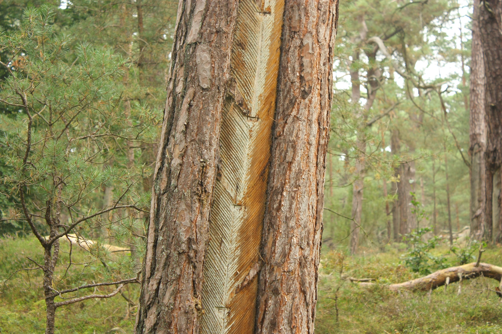
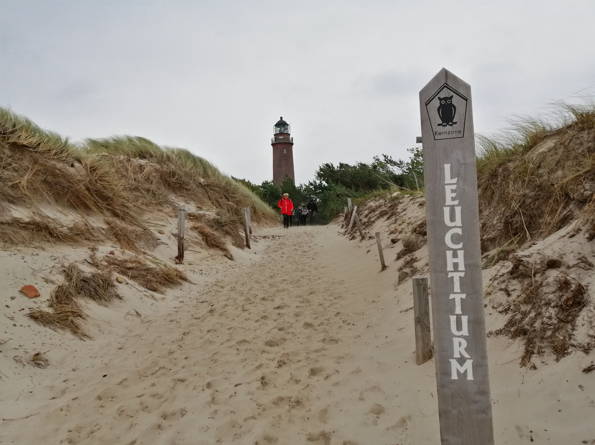
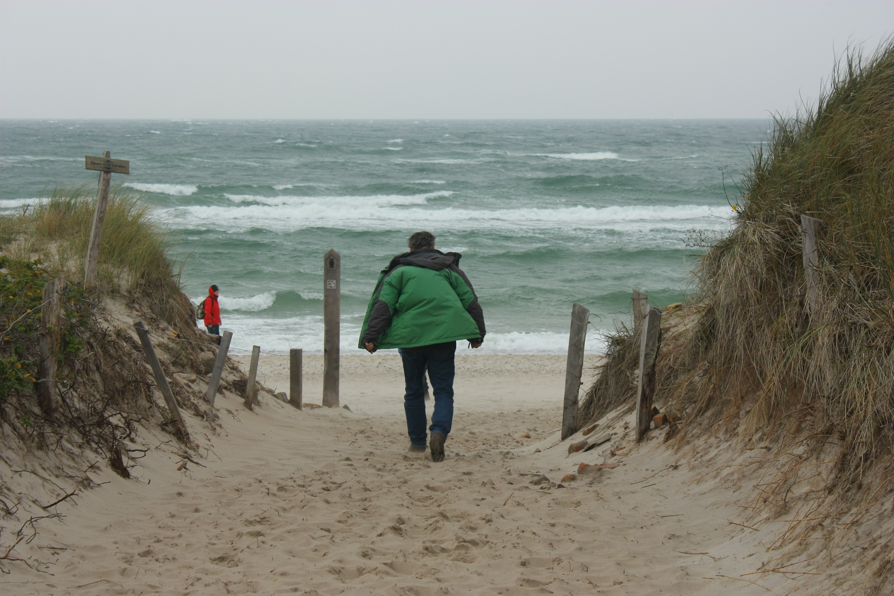

# Donnerstag, 23.09.2021

Abfahrt: [Jugendherberge Warnemünde](https://www.jugendherberge.de/jugendherbergen/warnemuende-188/portraet/)

Standorte: Fischland-Darß-Zingst - Stralsund

Ankunft: [Jugendherberge Warnemünde](https://www.jugendherberge.de/jugendherbergen/warnemuende-188/portraet/)

## Fischland-Darß-Zingst

<div style="text-align: justify">

<iframe src="https://www.google.com/maps/embed?pb=!1m18!1m12!1m3!1d10068.799309150705!2d12.51028801892204!3d54.47521845332957!2m3!1f0!2f0!3f0!3m2!1i1024!2i768!4f13.1!3m3!1m2!1s0x47acea66ad1ef0b7%3A0xf2861225509f94f8!2sLeuchtturm%20Dar%C3%9Fer%20Ort!5e0!3m2!1sde!2sde!4v1644833529173!5m2!1sde!2sde" width="800" height="600" style="border:0;" allowfullscreen="" loading="lazy"></iframe>

Für diesen Tag war eine Wanderung über die küstenmorphologisch bedeutsame Halbinsel Fischland-Darß-Zingst innerhalb des Nationalparks Vorpommersche Boddenlandschaft geplant. Sie befindet sich an der Mecklenburg Vorpommerschen Ostseeküste nordöstlich von Rostock und repräsentiert zusammen mit der Darß-Zingster Boddenkette das westliche Glied der vorpommerschen Boddenausgleichsküste (Janke & Lampe 2011). Die Inselkerne entstanden aus den Ablagerungen der von Norden kommenden Gletschervorstöße während der letzten Eiszeit (Weichsel: 115.000 bis 10.000 Jahre vor heute). Durch die enorme Kraft des bewegten Eises sind Geröllmassen in der hügeligen Landschaft abgelagert worden. Mit der Erwärmung des Klimas und dem Schmelzen der Gletscher stieg der Meeresspiegel an und es bildeten sich dem Festland vorgelagerte Inseln. Die glazial und glazifluvial entstandene Landschaft wird als Boddenküste und die gebildeten Meeresbuchten als Bodden bezeichnet. Die Länge der mecklenburgischen Ostseeküste beträgt 277 km. Bezieht man die landseitigen Buchten- und Boddenküsten mit ein, so ergibt sich eine Gesamtlänge von 1945 km. Diese Zahl verdeutlicht das Ausmaß der Zerlappung der Küstenlinie durch die vielen Buchten und Bodden (Dikau et al. 2019). Definiert werden Bodden als ehemalige Meeresbuchten der Ostsee, die in der Weichseleiszeit durch die Überflutung von tiefer gelegenem Relief der Grundmoränen entstanden sind. Heute sind sie weitgehend vom Meer angeschnitten und zeichnen sich durch die einmalige Besonderheit aus, dass sie weder dem Meer noch den Binnenseen zugeordnet werden. Dies liegt an der Eigenheit des Boddenwassers. Der Salzgehalt innerhalb der Bodden liegt zwischen 0,6% und 0,9%. Zum Vergleich, der Salzgehalt der angrenzenden Ostsee liegt zwischen 1,5% und 2,0%. (mündl. Kommunikation Exkursionsleitung 2021). 

Die geomorphologische Küstenform der Ausgleichs- bzw. Boddenküsten entsteht durch Meeresströmungen, die an der Ostseeküste von Westen nach Osten fließen. Dabei werden Sediment von den sich westlich befindenden (Steil-)küsten des Fischlandes sowie der Westküste des Darßes abgetragen. Bei nachlassender Strömungsgeschwindigkeit – häufig im „Schatten“ – von Inseln, wird das Sediment in Form von Sandbänken, Strandwällen und Sandhaken wieder abgelagert. Es kommt zu einer ständigen küstenparallelen Umverteilung der Sedimentmassen. Die entstandene Küstenform wird auch als Nehrung bzw. Nehrungsküste bezeichnet (Böse et al. 2018). Die Nehrungen zwischen den Inselkernen Fischland, Darß und Zingst trennen den Saaler Bodden und den Barther Bodden von der Ostsee. 

Da recht stürmisches Wetter angesagt war, packten wir unsere Regenkleidung ein und machten uns darauf gefasst, unsere geplante Wanderung frühzeitig abbrechen zu müssen. Von unserer Unterkunft aus fuhren wir in Richtung Nordosten und starteten unseren Fußweg zum Leuchtturm Darßer Ort von Prerow aus. Wir durchwanderten Teile des Darßer Waldes, durch seine Naturbelassenheit auch häufig als „Darßer Urwald“ bezeichnet. An einigen der Kiefern sind auffällige Muster in der Rinde zu erkennen. Dabei handelt es sich um sogenannte Harzlachten, aus denen bis in die späten 1980er Jahre Harz gewonnen wurde. Abbildung 12.1 zeigt eine dieser Harzlachten. Im Hintergrund ist sehr eindrücklich der „Darßer Urwald“ zu sehen. Harz wurde unter anderem für die Terpentinherstellung verwendet (Anders 2015, mündl. Kommunikation Exkursionsleitung 2021).

```{r, echo=FALSE, fig.align='center', fig.cap="Harzlachte in einer Kiefer"}

```

Ziel unserer kleinen Wanderung war der Leuchtturm Darßer Ort. Dieser verliert aufgrund der Küstendynamiken seit 1952 jährlich einen Meter Land. Dadurch sind seine Tage gezählt. In ein paar Jahrzehnten wird die Ostsee den Leuchtturm erreichen und diesen nach und nach unterspülen. Der Leuchtturm fußt auf Eichenpählen, die aufgrund der Unterspülung mit der Zeit beginnen werden zu faulen und das imposante Bauwerk somit den Wellen zum Opfer fällt (Informationstafel Darßer Ort 2021).  

```{r, echo=FALSE, fig.align='center', fig.cap="Strand am Darßer Ort mit Leuchtturm im Hintergrund"}

```

Heute zählt die Halbinsel zum Nationalpark Vorpommersche Boddenlandschaft und wird hauptsächlich als Freizeit- und Erholungsort für AnwohnerInnen und TouristInnen genutzt. Wir begegneten auf unserer Wanderung einigen Wandersleuten, RadfahrInnen sowie der [Darßbahn](https://www.fischland-darss-zingst.de/service/provider/details/stamm/show/darssbahn/). Angekommen am Leuchtturm Darßer Ort bot sich die Möglichkeit das [Natureum Darßer Ort](https://www.natureum-darss.de/) zu besichtigen. Das Natureum bietet allen Interessierten spannende Ausstellungen und ausführliche Informationen rund um den Natur- und Lebensraum der Ostseeküste, der morphologischen Küstendynamik sowie ein kleines Ostseeaquarium. Wir haben uns jedoch gegen die Besichtigung entschieden. Teile der Gruppe wanderten ein kleines Stück weiter bis an die stürmische Ostseeküste, an der die Erosionsdynamik und die küstenmorphologischen Prozesse in Echt begutachtet werden konnten.

Das Gebiet Darß-Zingst steht unter besonderem Schutz und gehört, wie bereits erwähnt, zum Nationalpark Vorpommersche-Boddenlandschaft. Dieser ist der dritt-größte Nationalpark Deutschlands und umfasst 786 km^2^ (78.600 ha) (Nationalpark Vorpommersche Boddenlandschaft 2020). Dazu erhielten Neu-Darß und der Darßer Ort 2006 das Prädikat "Nationaler Geotop". Dabei handelt es sich um eine Auszeichnung, die deutschlandweit an 77 bedeutsame Geotope verliehen wurde.

Auf dem Rückweg nach Prerow erfuhren wir von der Exkursionsleitung, dass die Halbinsel Fischland-Darß-Zingst seit jeher eine Besonderheit für unterschiedliche KünstlerInnen war. So entstanden bereit Anfang des 20. Jahrhunderts KünstlerInnenkolonien. Spuren davon sind noch heute an der hohen Dichte an Galerien und den reich verzierten Gebäuden zu erkennen (mündl. Kommunikation Exkursionsleitung 2021). 

```{r, echo=FALSE, fig.align='center', fig.cap="Die Exkursionsleitung auf stürmischer Erkundung."}

```

</div>

**Quellen**

- Anders, G., 2015. Die Halbinsel Darß und Zingst. Hinstorff Verlag, Rostock.

- Böse, M., Ehlers, J., Lehmkuhl, F., 2018. Deutschlands Norden. Vom Erdaltertum zur Gegenwart. Springer-Verlag, Berlin-Heidelberg.

- Dikau, R., Eibisch, K., Eichel, J., Meßenzehl, K., Schlummer-Held, M., 2019. Geomorphologie (1. Aufl.). Springer-Spektrum, Berlin-Heidelberg. 

- Exkursionsleitung, 2021. Vortrag vor und nach der Wanderung zum Darßer Ort.

- Informationstafel Darßer Ort, 2021. Die Tage des Leuchtturms sind gezählt. Öffentliche Information am Darßer Leuchtturm. 

- Janke, W., Lampe, R., 2011. Fischland - Darß - Zingst. In: Die deutsche Ostseeküste (2. Aufl.). Gebr. Borntraeger, Stuttgart, S. 219-231.

- Nationalpark Vorpommersche-Boddenlandschaft, 2020. Steckbrief des Nationalparks Vorpommersche Boddenlandschaft. https://www.nationalpark-vorpommersche-boddenlandschaft.de/wissen-verstehen/steckbrief. Zugriff: 01.02.22/10:02h.

## Stralsund

<div style="text-align: justify">

<iframe src="https://www.google.com/maps/embed?pb=!1m18!1m12!1m3!1d149020.22962277694!2d12.946002172062473!3d54.296150697108985!2m3!1f0!2f0!3f0!3m2!1i1024!2i768!4f13.1!3m3!1m2!1s0x47ab63a9b50b4b53%3A0x4251ae8ad8482d0!2sStralsund!5e0!3m2!1sde!2sde!4v1644837462655!5m2!1sde!2sde" width="800" height="600" style="border:0;" allowfullscreen="" loading="lazy"></iframe>

Im Anschluss an die windige und zunehmend regnerische Wanderung freuten wir uns über die Rückkehr in unseren warmen Bus und fuhren weiter in die Hansestadt Stralsund, die durch ihre Lage an der Meerenge Strelasund im Volksmund oft als *Tor zur Insel Rügen* bezeichnet wird (Tourismuszentrale Rügen 2022). Statt auf die Brücke nach Rügen fuhren wir zum Schnelltest Drive-in, wo sich einzelne mittlerweile leider erkältete Mitglieder der Gruppe einem - zum Glück negativ ausfallenden - Corona-Abstrich unterzogen. Da die Gruppe, hervorgerufen durch die Wanderung, von einem leichten Nachmittagstief eingeholt wurde, entschieden wir nach einem kurzen stürmischen Spaziergang durch die Stadt, das schlechte Wetter zu nutzen, um Stralsunds Gastronomiekultur zu erkunden. Bei Kaffee, Kakao und Kuchen wurde über die Wanderung revidiert und ein wenig durchgeatmet. Kurz danach traf die gesamte Gruppe in einem Kartoffelrestaurant zusammen, um hier gemeinsam zu Abend zu essen. Nach dem umfangreichen Abendessen in dem Kellergewölbe kam noch eine turbulente Rückfahrt auf uns zu, die durch die starken Windböen auf der dunklen Landstraße einen echten Abenteuercharakter annahm. Die laute Musik und Späße der Gruppenmitglieder hielten aber auch den Fahrer bei Laune, der die Gruppe letztendlich wohlbehalten zurück in die Jugendherberge brachte. 

</div>

**Quellen**

- Tourismuszentrale Rügen, 2022. Hansestadt Stralsund. https://www.ruegen.de/ueber-ruegen/inselorte/suedruegen/stralsund/, 2022-01-27. 