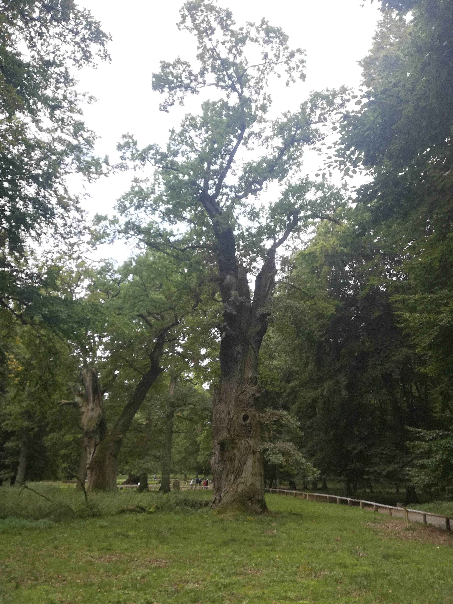
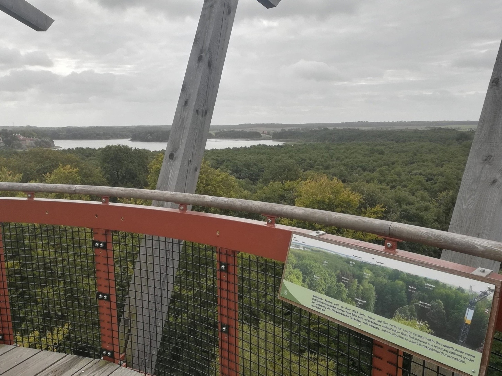
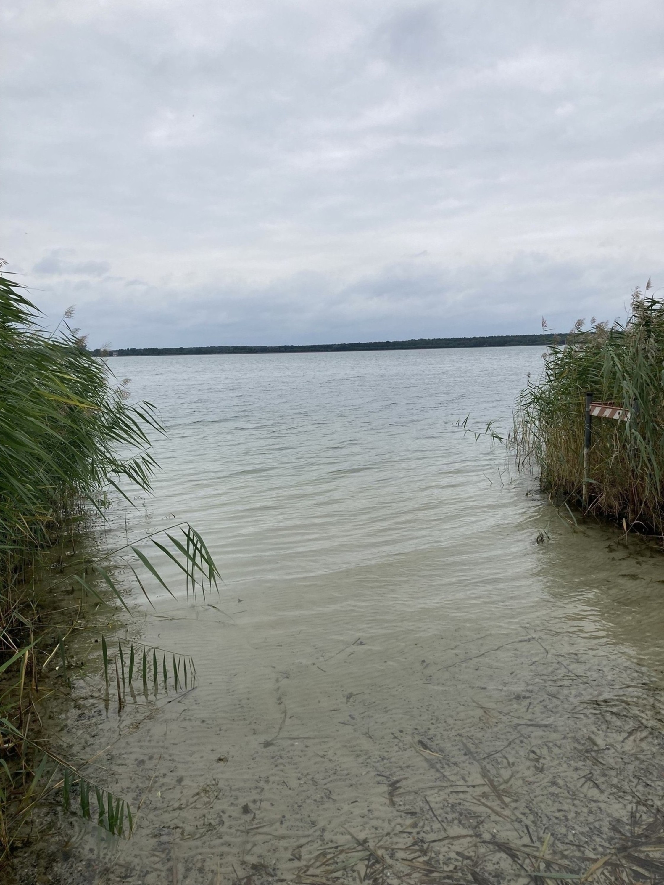

# Freitag, 24.09.2021 

Abfahrt: Jugendherberge Warnemünde

Standorte: Ivenacker Eichen, Arendsee

Ankunft: Jugendherberge Hitzacker


## Ivenacker Eichen (Julia)
<div style="text-align: justify">

Am heutigen Tag ging es erstmalig auf unserer Norddeutschlandreise wieder deutlich Richtung Süden. Nach einem üppigen Frühstück machten wir uns von Warnemünde aus auf den Weg in Richtung Südosten nach Ivenack im Landkreis mecklenburgische Seenplatte, um die 1000-jährigen Eichen, Deutschlands erstes nationales Naturmonument, zu besuchen. Nahe der Kleinstadt Stavenhagen in Mecklenburg-Vorpommern sind sie in eine Parkanlage eingebettet, die neben einem Waldgebiet mit Wanderwegen und einem beschilderten waldpädagogischen Erlebnispfad auch einen Tiergarten, ein Barockschlösschen und einen Baumkronenpfad beinhaltet. Bevor wir die Anlage betraten, verabschiedeten wir uns noch von Herrn Mansfeldt, von dem sich unser Weg nun trennte. 

Bei den [Ivenacker Eichen](https://www.wald-mv.de/Forstaemter/Stavenhagen/Nationales-Naturmonument-Ivenacker-Eichen/) handelt es sich um mehrere sehr alte Stieleichen, die durch ihr hohes Alter und Volumen zum Naturdenkmal gekürt wurden. Die ersten dieser Eichen entdeckten wir bereits mit dem Betreten der Parkanlage, wo sie mit eigenen Steckbriefen versehen und durch weiträumige Holzbarrieren umrahmt sind. Diese sollen die alten Bäume vor Trittschäden oder Bodenverdichtungen im Kronen- und Wurzelbereich schützen, um ihren Zerfall zu verlangsamen. Wie man an den Steckbriefen bereits erkennen kann, handelt es sich bei den Altersangaben der Bäume um ungefähre Schätzungen und nicht jede der Eichen wird, wie der Name es vermuten ließe, auf 1000 Jahre geschätzt. Dennoch lassen Jahresringmessungen der mittlerweile teils hohlen Bäume darauf schließen, dass sich unter ihnen Eichen befinden, die 600-700 Jahre alt oder sogar tatsächlich 1000 Jahre alt sind. Damit werden die Ivenacker Eichen auch zu den ältesten Bäumen Deutschlands gezählt, die mächtigste der alten Eichen gilt mit 140 Kubikmetern außerdem als volumenreichste Eiche in ganz Europa (Landesforst Mecklenburg-Vorpommern 2021). 

```{r, echo=FALSE, out.width="100%", fig.cap="Eine der ältesten Eichen - Vermutetes Alter: 1000 Jahre."}
knitr::include_graphics("images/Julia/IMG_20210924_110239.jpg")
```


Auch das Waldgebiet, zu dem die Eichen gehören, wird als naturhistorische Besonderheit behandelt, denn es handelt sich um einen ehemaligen mittelalterlichen Hudewald, dessen Bedingungen vom Forstamt Stavenhagen bis heute aufrechterhalten werden. Als Hudewald bezeichnet man eine mittelalterliche Landnutzungsform, bei der Vieh statt auf Grünland in den Wald getrieben wurde, um zu fressen. So ernährten sich Schweine beispielsweise von den dort gefundenen Eicheln, aber auch anderes Vieh wie Ziegen, Rinder und Schafe ernährten sich von Waldfrüchten, Wildobst und Pilzen. Dabei wurden auch neue Triebe und Aufwuchs abgefressen, sodass sich einzelne Bäume besonders gut entwickeln konnten. In Ivenack wurde diese Aufgabe seit Ende des 17. Jahrhunderts vor allem von Damwild übernommen. Für die gute Pflege der alten Bäume und die durch die Aufrechterhaltung der Bedingungen hervorragende Veranschaulichung der mittelalterlichen Bewirtschaftungsform erhielt das Waldgebiet 2020 vom Bund Deutscher Forstleute die Auszeichnung *Waldgebiet des Jahres* (Landesforst Mecklenburg-Vorpommern 2021, Beschilderung im Ivenacker Erlebnispfad). 

```{r, echo=FALSE, out.width="100%", fig.cap="Mehrere alte Eichen des ehemaligen Hudewalds."}

```

Neben dem imposanten äußeren Erscheinungsbild der alten Eichen ist wohl auch ihr symbolischer Charakter prägend für ihre heutige Bedeutung. Eichen stehen symbolisch für Stetigkeit und Dauerhaftigkeit und spielen in vielen Sagen, Mythen und Geschichten der mitteleuropäischen Kultur eine Rolle. So gibt es auch über die Ivenacker Eichen verschiedene Erzählungen, z.B. eine die besagt, dass es sich bei den Eichen um einst verwandelte Nonnen aus dem Zisterzienserinnen-Kloster handelt. Auch werden die Bäume in historischen Erzählungen erwähnt, z.B. soll Anfang des 19. Jahrhunderts ein Schimmelhengst in einer hohlen Eiche vor den heranrückenden Franzosen versteckt worden sein, sich aber durch Wiehern verraten haben (Landesforst Mecklenburg-Vorpommern 2021). 

Nachdem wir die alten Eichen angeschaut hatten, begingen wir gemeinsam den Baumkronenpfad, in dem solche Geschichten aufgegriffen und wiedererzählt wurden. Dieser ist mit seiner Eröffnung 2017 noch relativ neu und bietet mit einer Länge von 620 m in Höhe der Baumkronen einen Rundumblick über das Waldgebiet und die Bäume von oben. Man begeht den Pfad über verschiedene, langsam aufsteigende Hängebrücken aus Holz, die durch ihr leichtes Mitschwingen vor allem etwas für schwindelfreie BesucherInnen sind und manche TeilnehmerInnen vor eine kleine Herausforderung stellten. Zwischendurch gibt es immer wieder Stationen, um innezuhalten, Informationstafeln zu lesen, Rätsel zu lösen, oder z.B. durch ein Hörrohr den Geräuschen des Waldes zu lauschen. Letztendlich endet der Pfad auf einem 40 m hohen Aussichtsturm, wo wir gemeinsam die Aussicht auf den Ivenacker See und das gesamte Waldgebiet genossen. 

```{r, echo=FALSE, out.width="100%", fig.cap="Der Baumkronenpfad von oben betrachtet."}
knitr::include_graphics("images/Julia/IMG_20210924_114524.jpg")
```
```{r, echo=FALSE, out.width="100%", fig.cap="Ausblick auf den Ivenacker See."}

```


Nach dem Baumkronenpfad schauten wir noch kurz in die Tiergehege, wo wir die Turpolje-Schweine, eine bedrohte Schweinart, eine Weile suchen mussten, bevor wir sie entdeckten. Unter den Eichen im Ivenacker Tierpark steht ihnen ein artgerechtes Gehege zur Verfügung, den BesucherInnen auch die Funktion des Gebiets als Hudewald noch einmal vor Augen führt. Im Anschluss daran entschied unsere Gruppe, genug Eindrücke vom Ivenacker Park gesammelt zu haben, um den Barockpavillon zu überspringen und uns auf den Weg zum Arendsee zu machen. 

</div>

**Quellen**

*Einige Informationen wurden der Beschilderung des Erlebnispfads im Ivenacker Park entnommen.*

Landesforst Mecklenburg-Vorpommern, 2021. Nationales Naturmonument Ivenacker Eichen. https://www.wald-mv.de/Forstaemter/Stavenhagen/Nationales-Naturmonument-Ivenacker-Eichen/, 2021-12-07. 


## Arendsee (Florian)

<div style="text-align: justify">
Nach dem Besuch der Ivenacker Eichen ging es zum Arendsee in der Region [Altmark](https://www.arv08.de/verein/segelrevier-umgebung/) in Sachsen-Anhalt. Dort machten wir direkt am Ufer halt, mit gutem Blick auf den See. Hier erzählte uns Kristof etwas über die Entstehung des Sees.

```{r, echo=FALSE, out.width="70%", fig.cap="Arendsee."}

```

Die Entstehung des Arendsees, mit seinen charakteristisch steilen Flanken, unterschiedet sich von der Mehrheit anderer Seen, wie zum Beispiel dem Zungenbeckensee.

Der Zechstein begann vor rund 257 Millionen Jahren und endete or etwa 251 Millionen Jahren. Diese Zeit war sehr prägend und intensiv. Das von Norden kommende relativ flachmarine Zechsteinmeer hinterließ bei seinen Transgressionen in die heutigen mitteleuropäischen Regionen bis zu sieben Zyklen innerhalb dieser Zechsteinphase, mit teils karbonatischen und teils evaporitischen Sedimenten (Werra, Staßfurt, Leine, Aller, Ohre, Friesland und Fulda). Diese Folgen sind nicht immer mustergültig ausgeprägt. Beispielsweise findet man nur ein paar bestimmte Folgen, dann werden diese eventuell komplett wegerodiert. Da Salze wasserlöslich sind, können diese auch wieder gelöst und verlagert werden. Ein Zyklus besteht normalerweise aus Tonstein, überlagert von Kalkstein und darüber eine Folge aus Anhydrit und Steinsalz. Diese Abfolge wird auch Saline-Serie oder Salinare genannt. 
Bei Absetzung der Sedimentationsgeschwindigkeit bilden sich feinkörnige Tone (Tonsteine). Als nächstes fallen Karbonate aus (Calciumcarbonat oder Dolomit). Karbonate sind schlecht wasserlöslich (14 Milligramm pro Liter). Danach fallen Sulfat-Verbindungen (z.B. Gips und Anhydrit) aus. Aus diesem Grund hat man erst Tone, dann die Karbonate und dann die Sulfate. Als letztes bilden sich die Edelsalze (z.B. Steinsalz, Natriumchlorid, Kochsalz, oder Kaliumchlorid). Somit findet man in Norddeutschland bis zu 2.000 Meter mächtige Zechsteinabfolgen von Salzen. Salz hat in besonders hohen Tiefen (wenn viel Druck darauf liegt) die Eigenschaft sehr zähplastisch zu werden, weil es eine geringere Dichte hat als zum Beispiel die Sedimente, die darüber liegen. Es neigt dann dazu, sich den Weg nach oben zu bahnen. 

Der Arendsee liegt direkt über einem Salzstock. Das tiefe Grundwasser ist für die Auslaugung des Salzes verantwortlich. Während es in Süddeutschland Karstgrundwasserleiter gibt, die sehr schnellzügig sind, dauert es in dieser Region eine Weile, bis das Grundwasser in Kontakt mit den Salzschichten kommt. Durch die Subrosion entstehen große Hohlräume im Untergrund, was beim Arendsee zu mehreren Einbrüchen des Deckgebirges geführt hat. 
Subrosion kennzeichnet die natürliche unterirdische Auflösung und Verfrachtung wasserlöslicher Gesteine wie Steinsalz, Gips, Anhydrit und Kalkstein durch Grundwasser oder versickerndes Oberflächenwasser.

Das Gewässer wird daher auch Subrosionssee genannt und gilt in Norddeutschland neben dem Zwischenahner Meer als das größte Gewässer seiner Art. Nach dem Abschmelzen der letzten Eiszeit hat das eingestürzte Deckgebirge somit eine große Hohlform gebildet, die sich dann mit dem geschmolzenen Wasser füllte. Durch diesen Prozess ist schließlich der heutige Arendsee entstanden mit seinen charakteristisch steilen Flanken.

Nach diesen interessanten Informationen, die uns Kristof mit auf den Weg gab, ging es zurück zum Auto, und damit weiter zu unserer letzten Jugendherberge. Nach einem leckeren Abendessen ließen wir den Abend in unserem Aufenthaltsraum bei einer letzten Partie Knack ausklingen - mit einem knappen aber hoch verdienten Sieg für Florian. Als Preis gab es den wundervollen Roman "Kurze Geschichte des Traktors auf Ukrainisch" von Marina Lewycka.


**Quellen** 

*Die Informationen entstammen aus dem persönlichen Gespräch mit Kristof, der uns den See zeigte.*

Arendsee Regattaverein, 2021. Abrufbar unter: https://www.arv08.de/verein/segelrevier-umgebung/. Letzter Zugriff am 05.01.2022.

Landesamt für Geologie und Bergwesen Sachsen Anhalt, 2022. Abrufbar unter: https://lagb.sachsen-anhalt.de/fileadmin/Bibliothek/LaGB/inggeol/doc/Subrosion.pdf. Letzter Zugriff am 14.02.2022.

Subkommission für Perm-Trias-Stratigraphie in der Deutschen Stratigraphischen Kommission (DSK), 2022. Abrufbar unter: http://www.stratigraphie.de/perm-trias/antrag69.pdf. Letzter Zugriff am 14.02.2022.


</div>
