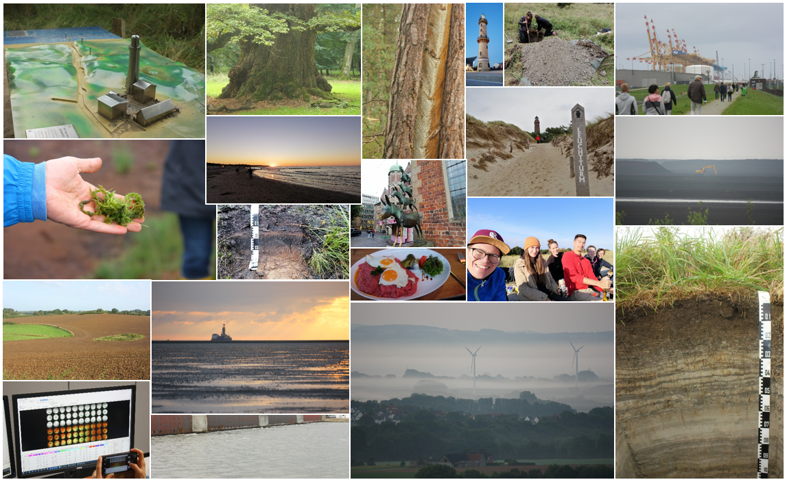

--- 
title: "Reise-Blog zur großen Norddeutschlandexkursion"
author: "Christian Gerardy, Florian Rinke, Jana Glombitza, Julia Edelmann, Maren Hövels"
date: "Aktualisiert am: `r Sys.Date()`"
site: bookdown::bookdown_site
bibliography: [book.bib, packages.bib]
# url: your book url like https://bookdown.org/yihui/bookdown
# cover-image: "images/cover.png"
description: |
  Dies ist ein Reise-Blog zur Großen Exkursion im Sommersemester 2021 des Geographischen Institutes der Universität zu Köln.
link-citations: yes
github-repo: rstudio/bookdown-demo
---

# Einleitung {-}

<div style="text-align: justify">

```{r, echo=FALSE, out.width="100%", fig.align='center'}

```

Im Rahmen des Moduls *Geländeerfahrung* des Masterstudiengangs "Geographie“ der Universität zu Köln fand vom 13. bis 25. September 2021 eine universitäre Exkursion nach Norddeutschland statt. Die fünf teilnehmenden Studierenden wurden von Herrn Prof. Dr. Mansfeldt und Herrn Dr. Kristof Dorau betreut.  
So unterschiedlich wie die Studienausrichtung der Teilnehmenden - unter uns zwei angehende Bodenkundlerinnen, ein Stadtgeograph, ein Anthropogeograph und eine Lehrämtlerin - war auch das Programm der Exkursion gestaltet. Angelehnt an die Reise durch 12.000 Jahre Natur- und Kulturgeschichte des Holozän besuchten wir verschiedenste städtische und ländliche Standorte, untersuchten deren Genese oder die dortigen Mensch-Umwelt-Interaktionen und bearbeiteten dabei Themen wie die Moorgenese, Tierhaltung und Grundwasser, Quartäre Formen, Eiszeiten, Küstenmorphologie, das Ökosystem Watt und den Klimawandel.
In unserem Mietbus legten wir dabei mehr als 2.000 km zurück, schliefen in mal luxuriösen, mal renovierungsbedürftigen Unterkünften und probierten uns durch die herzhafte norddeutsche Küche, mit insgesamt über 20 Fischbrötchen jeder Couleur sowie durch die diversen und durchaus leckere norddeutsche Bierkultur. 
Nach zwei schnelllebigen Exkursionswochen bedanken wir uns ganz herzlich bei Herrn Prof. Dr. Mansfeldt und Herrn Dr. Dorau für die vielen abwechslungsreichen Eindrücke, aufschlussreichen Diskussionen und die stets gute Laune. Wir durften einen wunderschönen Teil Deutschlands neu Kennenlernen und hoffen unsere Eindrücke im folgenden Blog weitertragen zu können. Wir wünschen allen LeserInnen gute Unterhaltung und hoffen, dass dabei auch die ein oder andere wissenschaftliche Information hängen bleibt. 

</div>

